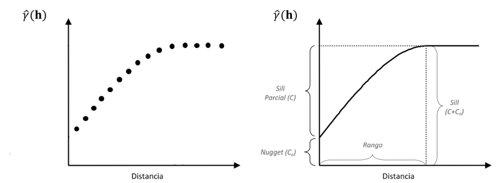
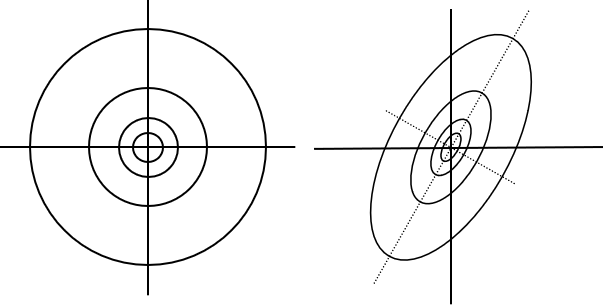
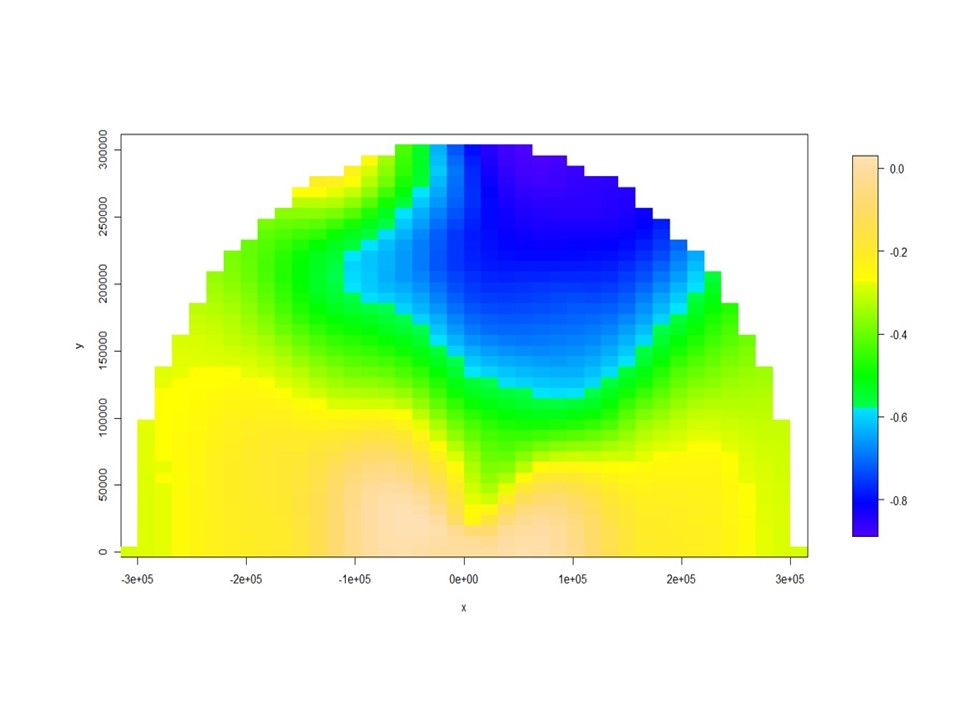

\cleardoublepage 

# (PART) Aproximaciones metodológicas {-}


# Manejo de datos espaciales

Cuando los datos georreferenciados se representan en fotografías, imágenes o mapas es posible visualizar patrones espaciales, *i.e.* estructuraciones de los datos en el espacio. Los datos espaciales involucran, no solo la realización (valor) de una variable, sino también las coordenadas geográficas que posicionan el dato en el dominio espacial. Las coordenadas pueden ser uni, bi o tridimensionales y expresarse según distintos sistemas. Los tipos de datos espaciales usados son: datos geoestadísticos, datos regionales (látices) y patrones de puntos. Los primeros son datos de dominio continuo, es decir, supone que entre dos sitios pueden existir infinitos datos. Se refiere a continuidad en la estructura espacial del proceso aleatorio espacial subyacente a partir del cual se han generado las observaciones que se tienen. A causa de la continuidad del dominio espacial, los datos geoestadísticos también se llaman "datos espaciales con variación continua". La continuidad se asocia entonces con el proceso aleatorio subyacente y no con el atributo medido (que la variable sea de naturaleza continua o discreta no determina si los datos son geoestadísticos o no). Los datos regionales o de áreas son aquellos donde el dominio es fijo y conformado por un conjunto discreto de áreas, superficies o polígonos. Los datos del tipo patrones de puntos son aquellos que provienen de un proceso puntual aleatorio conformado por los puntos o sitios donde ocurren los eventos.

En el trabajo con datos espaciales puede ser necesario realizar preprocesamientos previos al análisis estadístico. Es menester realizar la lectura de la o las capas de información (variables), proveer una descripción estadística de los datos y mapear o visualizar los datos en el espacio, eliminar valores atípicos. También puede requerirse la expresión del conjunto de variables en un mismo sistema de información geográfica o la necesidad de interpolar las variables de interés a una misma identidad espacial. Para el tratamiento de datos espaciales hay que considerar el formato de la información espacial (ráster o vectorial) y las particularidades del sistema de referencia.

La tecnología de sistematización para información georreferenciada más conocida es la de los Sistemas de Información Geográfica (SIG). Actualmente, éstos abarcan un complejo de sistemas de bases de datos, programas de escritorio, lenguajes de programación, dispositivos gráficos, aplicaciones web y servidores. En un SIG, los datos de cada variable pueden manejarse como capas de información, y diversas técnicas de análisis de datos pueden aplicarse simultáneamente en todas las capas de manera independiente o integrándolas en un único análisis multivariado. Las capas pueden estar correlacionadas entre sí, los datos dentro de cada capa pueden presentar estructura de correlación espacial. Los Sistemas de Información Geográfica (SIG) ofrecen funciones para crear, integrar, transformar, visualizar y analizar de manera exploratoria estas capas de datos espaciales. Los SIG más avanzados también disponen de funciones que generan interfase con softwares estadísticos ampliando así la capacidad para la modelación conjunta de varias capas de información.


## Transformación y conversión de coordenadas

Para localizar el sitio (coordenadas) con el cual se asocia un dato espacial, se necesita un sistema de referencia. Existen dos tipos de coordenadas, cartesianas y geográficas. Las coordenadas cartesianas se miden desde el centro de la tierra, mientras que las geográficas desde una superficie de referencia o *datum*. Para Sudamérica el *datum* comúnmente utilizado es WGS84 (*World Geodetic System 84*). Éste es el *datum* estándar por defecto para coordenadas en los dispositivos GPS comerciales. Para combinar capas de información o para realizar otros procesamientos de datos espaciales es necesario conocer el *datum* y frecuentemente transformar o convertir las coordenadas. Transformar implica pasar de un sistema de referencia a otro (cambiar el *datum*), mientras que cuando se convierten coordenadas no se cambia de *datum*.

Por una cuestión de practicidad, es usual proyectar el sistema de coordenadas geográficas (expresados en grados, minutos y segundos) a un sistema de coordenadas cartesianas, como por ejemplo el sistema de proyección UTM (*Universal Transverse Mercator*). Esta operación permite que las distancias entre los sitios desde donde se leen los datos se expresen como distancias absolutas (metros) en vez de distancias relativas (grados). Por ello, un paso inicial en el análisis de datos espaciales es convertir las coordenadas geográficas en coordenadas cartesianas (UTM). La mayoría del software SIG tiene la capacidad para realizar la transformación o conversión de coordenadas.


## Manipulación de múltiples capas de datos

Cuando se recolectan datos de más de una variable georreferencia (múltiples capas de datos especializados) es poco probable que se registre la misma ubicación para cada variable o tiempo de medición. Por ejemplo, rara vez las mediciones de propiedades del suelo y los índices derivados de imágenes satelitales de cultivos no son obtenidas exactamente para la misma localización y frecuentemente existen capas de datos en distintas escalas. Esta variabilidad en las coordenadas espaciales dificulta la fusión de datos para realizar análisis estadísticos multivariados, *i.e.* análisis que contemplen simultáneamente las distintas capas de datos.

Se necesita organizar los datos en una grilla común a todas las capas, de manera que cada celda de la grilla cuente con la información de su ubicación espacial y cada una de las variables medidas. Existen diversas alternativas metodológicas para crear este tipo de grillas. Una de ellas consiste en generar una grilla regular de una determinada dimensión la cual se interseca con cada una de las variables medidas. Luego los valores de cada capa son asignados al nodo de la celda más cercana al punto medido. Cuando se tiene más de un dato de una variable para el mismo nodo, se suele calcular una medida de posición como la media o mediana de los datos e inclusive en algunos casos puede ser de interés tomar una medida de variabilidad como el desvió estándar o coeficiente de variación de los datos que comparten la celda. Otra alternativa metodológica es generar la grilla regular y utilizar la información recolectada para realizar una interpolación espacial en sitios no medidos y así obtener una predicción espacial de la variable de interés en cada celda de la grilla. Este proceso se realiza para cada una de las variables medidas empleando la misma grilla. Diversos métodos de interpolación pueden ser usados, uno frecuente es la interpolación kriging.

El espaciado de la grilla debe reflejar el nivel de detalle requerido y la capacidad de procesamiento computacional. Por ejemplo, en aplicaciones de agricultura de precisión (escala de lote) puede utilizase una grilla de celdas cuadradas de 5 m × 5 m que se aproxima a la mitad del ancho operativo básico de muchas maquinarias. Esto genera unos 400 puntos de grilla por hectárea. Con lotes grandes puede ser conveniente utilizar una cuadricula de 10 m × 10 m para superar problemas computacionales y al mismo tiempo mantener una resolución de mapa adecuada para la visualización y análisis de los patrones espaciales.

La normalización de los datos es otra práctica comúnmente usada en el manejo de múltiples capas de datos. Con esta técnica se busca ajustar los valores de variables no conmensurables, incluso medidos en diferentes escalas a una escala común. La normalización puede realizarse en base a la media de cada capa o variable y expresar la unidad como un porcentaje (\%) de la media. La normalización también suele realizarse utilizando el máximo de la capa como referente o calculando la diferencia de la variable respecto al valor mínimo y dividiendo por el rango. Finalmente, cabe citar a la estandarización (sustracción de la media y división por el desvío estándar) como una transformación usual para expresar variables un conjunto de variables no conmensurables en un conjunto de variables normal estándar.

Un paso importante en el análisis exploratorio de datos geoestadísticos es explorar la distribución de la variable.  Para ello, puede realizarse una estadística descriptiva que incluye la elaboración de gráficos de distribución de frecuencias y medidas resumen (media, mediana y coeficiente de asimetría) de la variable en análisis. Cuando el método de análisis supone distribución normal de los datos, estas medidas exploratorias pueden ayudar a verificar el cumplimiento de los supuestos. Se considera que una distribución de frecuencias es simétrica y está próxima a la de una variable normal cuando la media y la mediana son prácticamente iguales y el coeficiente de asimetría es inferior a 1. La distribución de la variable también provee información para la depuración de datos raros.

## Depuración de datos

Los *outliers*, datos raros o atípicos, son observaciones con valores que se encuentran fuera del patrón general o distribución del conjunto de datos. La eliminación de los *outliers* es fundamental en el análisis de datos espaciales ya que las varianzas espaciales son muy sensibles a la presencia de datos raros. Los *outliers* deben eliminarse cuando el conjunto de datos no se limita dentro del rango de variación esperable con valores máximos y mínimos derivados de conocimiento previo sobre la distribución de la variable. También pueden eliminarse desde un criterio estadístico, cuando luego de calcular la media y la desviación estándar (SD), se identifican los valores que se encuentran fuera de la media $\pm$ 3 SD. Según conocimiento teórico, el 89\% de los datos de una variable debieran encontrarse entre la media $\pm$ 3 SD cualquiera sea la distribución de la variable. Es recomendable, antes de la eliminación de los *outliers*, graficarlos utilizando coordenadas espaciales para visualizar su localización. De esta manera será posible identificar si los datos seleccionados para ser eliminados se relacionan con algún patrón sistemático o se corresponden a errores aleatorios.

Al eliminar los *outliers* globales se eliminan los extremos del conjunto de datos, pero no los extremos locales (*outliers* espaciales). Los *outliers* espaciales, conocidos también como *inliers*, son datos que difieren significativamente de su vecindario, pero se sitúan dentro del rango general de variación del conjunto de datos. Existen estadísticos para identificar *inliers*, tal es el caso del índice autocorrelación espacial local de Moran (LM) [@Anselin_1995]. Dado un grupo de datos que pertenecen a diferentes vecindarios, el LM es aplicado a cada dato individualmente y da idea del grado de similitud o diferencia entre el valor de una observación respecto al valor de sus vecinos. La fórmula del índice de autocorrelación espacial local de Moran es la siguiente:

$${LM}_i=\frac{n\ (Z(s_i)-\bar{z})}{(n-1)s^2}\sum_{j=1}^{n}\left[w_{ij}\left(Z(s_j)-\bar{z}\right)\right]$$

donde $Z(s_i)$ es el valor de la variable z en la posición $i$; $\bar{z}$ y $s^2$ son la media y varianza muestral de $z$, respectivamente; $Z(s_j)$ es el valor de la variable $z$  en todos los otros sitios (donde $j\neq i$); $w_{ij}$ es el peso espacial entre las ubicaciones $i$ y $j$.

Para el cálculo del Índice de Moran se debe identificar el vecindario de cada dato, es decir el dominio donde existen datos que pueden ser interpretados como vecinos espaciales y que serán usados como referencia para decidir si el dato correspondiente es o no diferente a sus vecinos. Los vecindarios se definen a través de redes de conexión las que si bien pueden ser de distintos tipos pueden expresarse en el formato de una matriz de ponderación espacial $W$. Cuando $W$ es binaria, *i.e.* compuesta por ceros y unos, se indica con 1 si la posición $j$ se considera vecina a la posición $i$. Otra posibilidad para construir la matriz de ponderaciones espaciales es usando uná función de la distancia $d$ (usualmente distancia Euclídea) entre los sitios $i$, $j$ como elemento de $W$. Una función de amplio uso es la inversa de la distancia, es decir: $w_{ij}=1/d_{ij}$. Así, valores muy cercanos en el espacio tendrán mayor ponderación. Existen diferentes opciones para definir el tamaño y la forma de los vecindarios de un dato espacial.

El índice de Moran local esta estandarizado por lo que su nivel de significación puede ser evaluado en base a una distribución normal estándar. Los valores positivos del LM se corresponden con agrupamiento espacial de valores similares ya sean altos o bajos (autocorrelación positiva), mientras que un valor de LM negativo indica un agrupamiento de valores diferentes, por ejemplo, un sitio con valor bajo de la variable se encuentra rodeado de vecinos con valores altos (autocorrelación negativa).

Para determinar la significancia estadística de LM, se calcula el *valor-p* asociado a la prueba de hipótesis que establece que la correlación de la información de un sitio con la de sus vecinos es nula. El *valor-p* para un índice determinado debe ser lo suficientemente pequeño para considerar el valor en cuestión como un *outlier* espacial o *inlier* (rechazar la hipótesis nula). Dado que se realiza una prueba de hipótesis para cada uno de los puntos espaciales, se recomienda el ajuste de los *valores-p* por el criterio de Bonferroni.

Para visualizar el índice LM se puede representar en un diagrama de dispersión la similitud de cada valor observado respecto a las observaciones vecinas. Usualmente en el eje horizontal se expresan los valores de las observaciones mientras que en el vertical se representa el retardo espacial de la variable. Adicionalmente, se puede ajustar y añadir a este diagrama modelos de regresión lineal y estadísticos de influencia para identificar sitios con datos raros.


# Caracterización de variabilidad espacial

Denotamos el proceso espacial en $d$ dimensiones como: ${Z(s): s\in\ D\subset R^d}$ donde $Z$ denota el atributo que observamos, $s$ es la ubicación en la cual $Z$ es observada y es un vector de coordenadas de dimensiones $n\times2$  y $D$ es el dominio. Los procesos espaciales que se abordarán en este libro son procesos bidimensionales, $d=2$ y $s=x,y \prime$ son tratadas como coordenadas cartesianas. Cuando la $d$ es mayor a 1, el proceso estocástico subyacente es definido como un campo aleatorio.

La colección de n observaciones georreferenciadas que conforman un conjunto de datos espaciales deben entenderse como una muestra de tamaño uno de una distribución n-dimensional. En este caso la $E\left[Z(s)\right]=\mu(s)$ representa el promedio del atributo en la ubicación $s$ sobre la distribución de una posible realización. Si quisiéramos determinar el valor esperado para un sitio no observado, para $s_0$, sería necesario repetir las observaciones en ese punto, pero usualmente solo se tiene una observación por sitio. Sólo se puede hacer inferencia basada en una muestra de tamaño uno, bajo condiciones de estacionaridad, es decir cuando la esperanza es la misma en todos los puntos. Por ello, un supuesto importante para el análisis de los datos espaciales será el de estacionaridad. Bajo estas condiciones la variabilidad espacial podrá ser caracterizada a través de funciones basadas solo en varianzas y covarianzas o autocorrelaciones en los datos espaciales.

La autocorrelación espacial mide la correlación lineal entre los valores de una variable aleatoria y los de otra construida a partir del rezago de la primera. Puede interpretarse como medida de la coincidencia de valores similares de una variable en espacios geográficos cercanos, es decir, la variable tiende a asumir valores similares en unidades geográficamente cercanas. Mediado por la distancia, queremos saber qué tan semejante o diferente es el valor de la variable "consigo misma". Luego, para una variable espacialmente autocorrelacionada, los valores observados en el espacio no serán aleatorios, sino que estarán espacialmente relacionados.

La autocorrelación puede ser global o local. El primer tipo considera los valores de todas las observaciones, mientras el segundo solo los valores de las observaciones de un sitio respecto a los de observaciones vecinas. En ambos casos, la autocorrelación espacial puede ser medida en términos de su intensidad; una autocorrelación espacial fuerte significa que los valores del atributo de las unidades de observación geográfica vecinas muy parecidos o predecibles desde el valor del sitio, el caso contrario se produce cuando la distribución en sitios vecinos refleja un patrón aleatorio. El análisis de autocorrelación espacial requiere contar con una medida de correlación lineal apropiada para medir grados de semejanza entre las observaciones en un sitio y en su entorno.

Los índices de autocorrelación espacial expresan de manera formal el grado de correlación lineal entre las variables aleatorias representadas funcionalmente por el vector de valores observados y el vector de medias ponderadas espacialmente en las unidades vecinas, llamado el vector con *lag espacial*. El cálculo de estos índices en un espacio continuo requiere la definición de una matriz de ponderación espacial. Ésta puede tener elementos binarios para indicar cuáles son las observaciones que pertenecen al vecindario de cada dato, *i.e.* las observaciones "conectadas" con cada dato.

También puede tener como elementos, los valores de un coeficiente de continuidad que mide el grado de conexión entre un par de datos. El elemento $w_{ij}$ de la matriz de ponderaciones $W$, es el peso aplicado a la comparación de las observaciones en la posición $i$ y la posición $j$. Usualmente se utilizan redes de conexión que derivan en un matriz de pesos espaciales. La red de vecindarios también puede ser definida considerando puntos vecinos a aquellos contiguos ubicados entre un límite inferior y superior, previamente preestablecido. Cuando las entidades se encuentran distribuidas en forma homogénea en el espacio, suele recomendarse la red de conexión obtenida por el método de triangulación de Delaunay Las redes de conexión también pueden ser adaptadas manualmente pudiéndose excluir contactos entre sitios cercanos o incluir relaciones entre sitios lejanos.

Por ejemplo, el índice de autocorrelación espacial de Geary (GI), expresa la magnitud de las desviaciones entre observaciones en diferentes localizaciones. Siendo $w..$ la suma de todos los pesos, la expresión del índice es:

$$GI=\frac{(n-1)\sum_{i}\sum_{j}{w_{ij}(Z(s_i)\ -\ Z(s_j))^2}}{2w..\sum_{i}{(Z(s_i)-\bar{z})}^2}$$

El valor de GI se encuentra en el intervalo [0,2]. Si no hay autocorrelación espacial, el valor esperado de GI es 1. Valores del índice entre 1 y 2 indican autocorrelación espacial negativa, y entre 0 y 1 autocorrelación espacial positiva. Este índice se relaciona inversamente con el índice MI, es decir valores más cercanos a 0 sugieren autocorrelaciones positivas más fuerte. GI es más sensible a pequeñas diferencias entre posiciones vecinas que el IM. Los índices de autocorrelación espacial local son calculados para cada sitio y usan solo ponderadores para las distancias entre las observaciones de ese sitio y las restantes. El índice LM fue descripto anteriormente para ejemplificar su uso en la detección de *outliers*. Otro índice de autocorrelación espacial local es el índice de Getis Ord (GO) el que se calcula como la suma de los valores observados para la $j-ésima$ variable en el vecindario centrado del $i-ésimo$ píxel, en relación con la suma de todas las observaciones. Su expresión estandarizada es:

$${GO}_i=\frac{\sum_{i=1}^{m}{w_{i,i^\prime}{Z(s}_{i^\prime})-\bar{Z}\sum_{i=1}^{m}w_{i,i^\prime}}}{S\sqrt{\frac{m\sum_{i=1}^{m}{w_{i\neq i^\prime}^2-\left(\sum_{i=1}^{m}w_{i\neq i^\prime}\right)^2}}{n-1}}}$$

donde $w_i$ representa pesos espaciales en un vecindario del $i-ésimo$ píxel de tamaño $m$. Valores positivos de GO indican grupos locales de valores altos para la variable alrededor de la $i-ésima$ ubicación, mientras que valores negativos indican grupos locales de valores bajos alrededor de la $i-ésima$ ubicación. Para evaluar la significancia estadística de estos índices es posible utilizar procedimientos del tipo Monte Carlo [@Babai_1979]. Las ubicaciones son permutadas en el espacio para obtener la distribución del índice bajo la hipótesis nula de distribución aleatoria.


## Semivariogramas


La dependencia espacial o autocorrelación espacial, puede modelarse mediante un semivariograma. Esta función permite analizar la estructura y la naturaleza de la dependencia espacial en un conjunto de observaciones geo-referenciadas. El proceso espacial puede ser representado por el siguiente modelo estadístico:

$$Z\left(s\right)=\mu+\varepsilon\left(s\right)$$

donde $\mu$ es la media del proceso y $\varepsilon\left(s\right)$ es un término de error aleatorio con media cero y covarianza $C(h)$, donde $h$ es el *lag* o separación en el espacio entre dos sitios particulares. Un campo aleatorio ${Z(s):\ s\in\ D\subset R^d}$ es estrictamente estacionario si la distribución espacial es invariante bajo traslación de las coordenadas a través de todo el dominio (estacionaridad en sentido fuerte). La estacionaridad de segundo orden, o estacionaridad en sentido débil, se produce cuando $E\left[Z\left(s\right)\right]=\mu\left(s\right)$ y $Cov\big[Z(s),Z(s+h)\big]=C(h)$. Es decir, en un campo aleatorio estacionario de segundo orden, la media es constante y la covarianza entre observaciones sobre diferentes posiciones, es función de la separación espacial entre los sitios en las que son tomadas, $C(h)$ es la función de covarianza del proceso espacial. La estacionaridad de primero orden implica la estacionaridad de segundo orden, pero la inversa no es cierta.

Dado que $C(h)$ no depende del valor de las coordenadas y $Cov\big[Z(s),Z(s+0)\big]= Var \big[Z(s)\big]=C$, en procesos estacionarios de segundo orden, la variabilidad es la misma en todas partes, *i.e.* $Var [Z(s)]=\sigma^2$ no es una función de la ubicación espacial. En síntesis, un proceso espacial estacionario de segundo orden tiene media y varianza constantes y la función de covarianza no depende en absoluto de las coordenadas. A $C\left(h\right)$ también se la conoce como función de autocovarianza y depende de la escala en la cual $Z$ fue medida. Resulta más conveniente y fácil de interpretar si se la hace adimensional convirtiéndola en autocorrelación $\rho\left(h\right)=\frac{C(h)}{C}$. La función $\rho\left(h\right)$ se denomina correlograma del proceso espacial.

Aún si $Z(h)$ no es estacionaria de segundo orden, el incremento $Z(s)-Z(s+h)$ puede serlo. Un proceso que tiene esta característica se dice que tiene estacionaridad intrínseca. Esto se produce si $E\big[(Z(s)\big]=\mu$ y $\frac{1}{2}Var\big[Z(s)-Z(s+h)\big]=\gamma(h)$.

La función $\gamma(h)$ es llamada semivariograma del proceso espacial. La clase de procesos intrínsecamente estacionario es más grande que la clase de procesos estacionarios de segundo orden  Notar que un proceso espacial que presenta estacionaridad intrínseca no es necesariamente estacionario de segundo orden. En condiciones de estacionaridad de segundo orden la función de covarianza es el semivariograma.

Un proceso que parece estacionario en una escala podría no serlo a otra escala (*i.e.* presentar una tendencia o un componente sistemático). En el modelo, $\mu$ será remplazado por $\mu(s)$, *i.e.* término de tendencia determinístico para el sitio $s$. El semivariograma, en estos casos se calcula sobre los residuos del modelo. El semivariograma, puede interpretarse como función de la varianza de la diferencia entre las observaciones. Si el semivariograma es sólo una función de la distancia entre observaciones, entonces es conocido como semivariograma isotrópico, *i.e.* no depende de la dirección. El semivariograma y covariograma son parámetros del proceso espacial y juegan un rol crítico en los métodos geoestadísticos de análisis de datos espaciales.

Un primer paso para caracterizar la variación espacial en un dominio continuo es construir un semivariograma experimental o empírico. Una fórmula usual para computar semivariogramas, es conocida como estimador de los momentos de Matheron

$$\hat{\gamma}(h)=\frac{1}{2 m (h)}\sum_{i=1}^{m(h)} \Big\{Z(s_i)-Z(s_i+h) \Big\}^2$$

donde $m(h)$ es el número de pares de puntos separados por la particular distancia $h$. El otro estimador ampliamente usado es el estimador de Cressie- Hawkins o estimador robusto cuya fórmula se expresa como


$$2 \widetilde{\gamma}(h)= \frac{\Big[ \frac{1}{m(h)} \sum_{i=1}^{m(h)} \Big| Z(s_i) - Z(s_i + h) \Big| ^\frac{1}{2}  \Big] ^4}{0,457 + \frac{0,494}{m(h)} + \frac{0,045}{m^2(h)}}$$


Este estimador puede ser menos sesgado que $\hat{\gamma}(h)$ cuando la varianza residual es relativamente pequeña siendo también menos sensible a la presencia de valores externos. El estimador muestra típicamente menor variación en distancias pequeñas y también resulta en valores generalmente más pequeños que el estimador de los momentos de Matheron. Computando cualquiera de los dos estimadores, para las distancias $h$, obtenemos un conjunto ordenado de semivarianzas. Tales semivarianzas graficadas en función h constituye el semivariograma empírico o experimental.

Los parámetros de un semivariograma son: la varianza nugget o simplemente nugget $(C_0)$, la varianza estructural o sill parcial $(C)$ y el rango $(R)$. La asíntota es llamada la meseta del semivariograma o $C$ y el lag o distancia $h^\ast$ en el cual la meseta es alcanzada se denomina $R$ o rango. Observaciones $Z(s_i)$ y $Z(s_j)$ para las cuales $|| Z(s_i) - Z(s_j)|| \geq h^\ast$ son espacialmente independientes. Si el semivariograma alcanza la meseta asintóticamente, se define el rango práctico $(R_P)$ como la distancia en el cual la semivarianza alcanza el 95\% de la varianza umbral o total.


```{r semivariogramasej, echo = FALSE, fig.cap= "a) Semivariograma empírico. b) Semivariograma teórico, modelo esférico. Se representan los tres parámetros que lo definen: rango, sill y efecto pepita o nugget."}

```


En la práctica el semivariograma empírico $\hat{\gamma}(h)$ puede no pasar a través del origen. La ordenada al origen del semivariograma representa a $C_{0}$, por lo tanto $C_0=\lim_{h\rightarrow0}{g(h)}\neq0$. Este parámetro representa la suma de errores aleatorios o no estructurados espacialmente, así como errores asociados con la variabilidad espacial a escalas más finas que la usada para realizar las mediciones. Un alto valor de $C_0$ indica que la mayoría de la variación espacial no es explicada por el semivariograma. La varianza umbral o sill se obtiene sumando las varianzas antes mencionadas ($C_0+C$) y es la varianza de observaciones independientes, es decir observaciones que fueron tomadas a mayor distancia que $R$.

Un semivariograma se define como anisotrópico si cambia en alguna forma respecto a la dirección que se considere. Si el semivariograma no solo depende de la longitud del vector h sino también de la dirección del vector entonces el semivariograma es anisotrópico. En los casos isotrópicos, los contornos de isocorrelación son esféricos, mientras que en el caso que haya anisotropía los contornos de isocorrelación son elípticos. Se reconocen dos tipos de anisotropía: anisotropía geométrica y anisotropía zonal. Anisotropía geométrica ocurre cuando el rango del semivariograma cambia en las distintas direcciones, pero no la varianza sill, por lo tanto, la correlación es más fuerte en una dirección que en otra. Anisotropía zonal existe cuando la varianza estructural del semivariograma cambia con la dirección. Anisotropía geométrica significa que la correlación es más fuerte en una dirección que en otra.

Una forma en que la anisotropía geométrica puede ser identificada es graficando un semivariograma experimental direccional. Diferencias en el semivariograma muestral usando diferentes ángulos al computarlo, es indicador de anisotropía. La anisotropía geométrica puede ser modelada cambiando el modelo de semivariograma por un proceso isotrópico transformando las coordenadas. Los modelos teóricos de semivariograma más usados en predicción espacial están basados son isotrópicos, por lo que es necesario una corrección en casos de anisotropía para poder utilizar la metodología clásica de predicción en geoestadística. El radio de anisotropía, es decir, el cociente entre los rangos de la dirección de máximo y mínima variación es usada para mesurar anisotropía. Algunos autores consideran que existe anisotropía significativa si el radio de anisotropía es mayor a 2,5.

```{r modeloIsoAniso, echo = FALSE, fig.cap = "a) Modelo isotrópico. b) Modelo anisotrópico, con ángulo de anisotropía de 45º y un radio de anisotropía de 0,5."}



```


En los procesos espaciales continuos, caracterizados por semivariogramas suelen obtenerse medidas del grado de estructuración espacial. Una de éstas es la varianza estructural relativa (RSV):

$$RSV=\Bigg(\frac{C}{C+C_0}\Bigg)\times100\%$$


Un valor alto de RSV indica que las predicciones geoestadísticas serán más eficientes que aquellas obtenidas con métodos de predicción que ignoran la información espacial. Un valor alto de RSV también indica una continuidad mayor del proceso espacial. @Zimback_2001 establece que el grado de dependencia espacial puede ser clasificado como: $RSV \leq 25\%$ bajo, $RSV$ entre $25\%$ y $75\%$ medio y $RSV \geq 75\%$ alto. También se puede calcular el cociente $\frac{C_0}{C_0+C}$ y en función de éste hablar de estructura espacial fuerte cuando el cociente es: $\leq 25\%$, intermedia si el mismo se encuentra entre 25\% y 75\% y débil si el mismo es mayor al 75\%.


### Ajuste de semivariogramas

El semivariograma empírico $\hat{\gamma}(h)$, es un estimador insesgado de $\gamma(h)$, pero provee solo estimaciones para un conjunto finito de distancias. Para obtener estimaciones de $\gamma(h)$, para cualquier lag, al semivariograma empírico se le ajusta un modelo teórico. El análisis geoestadístico sigue entonces estos dos pasos: 1) obtención del semivariograma empírico y 2) ajuste de un modelo teórico de semivariograma al semivariograma empírico.

Las funciones que sirven como modelos teóricos de semivariograma deben ser condicionalmente definidas positivas. Existen varios modelos teóricos para funciones semivariogramas, entre los que se encuentran el modelo nugget, el lineal, el esférico, el gaussiano y el exponencial (Figura \@ref(fig:figSemivariogramas)). El semivariograma de un proceso de ruido blanco (modelo nugget), donde los valores $Z\left(s\right)$ se comportan como muestras aleatorias, todas con igual media y varianza sin correlación entre ellas. Este modelo suele ajustar el semivariograma empírico cuando la menor distancia de muestreo en los datos es mayor que el rango del proceso espacial.


```{r figSemivariogramas, echo = FALSE, purl=FALSE, fig.cap="Funciones de semivariograma para el modelo exponencial, esférico y gaussiano. $C_0$=2, $C$=10 y $R$=200" }
knitr::include_graphics("figuras/Semivariogramas.jpg")
```

El modelo esférico es uno de los más populares entre los modelos de semivariograma. Tiene dos características principales: un comportamiento lineal cerca del origen y el hecho de que a la distancia $R$ el semivariograma encuentra la meseta y después de esta se mantiene llano. El modelo exponencial se aproxima a la meseta del semivariograma asintóticamente cuando $\parallel h \parallel\to\infty$. En la parametrización mostrada en la Figura \@ref(fig:figSemivariogramas), el parámetro $R$ es el rango práctico del semivariograma. Frecuentemente el modelo puede encontrarse en una parametrización donde el exponente es $-\parallel h \parallel / R$. Entonces el $R_p$  corresponde a $3R$. Para el mismo rango y meseta de un modelo esférico, el modelo exponencial alcanza el rango más rápidamente, es decir, a menor distancia que el modelo esférico. El modelo gaussiano exhibe un comportamiento cuadrático cerca del origen y produce una correlación de corto rango que son las más altas que para cualquier modelo estacionario de segundo grado con el mismo rango práctico. Además, es el más continuo cerca del origen de los considerados aquí. En la parametrización el rango práctico es $\sqrt{3R}$.

Es importante notar que, si se realiza un análisis basado en semivariogramas y se pretende comparar los parámetros de los semivariogramas obtenidos bajo distintas condiciones, la utilización de modelos teóricos diferentes resulta poco útil. Hay que tener en cuenta que, por ejemplo, los rangos del modelo esférico y el exponencial no son directamente comparables. El modelo esférico es el único que tiene un umbral verdadero, ya que tanto el modelo exponencial como el gaussiano alcanzan el umbral de forma asintótica, o lo que es lo mismo, no lo alcanzan nunca y el modelo lineal no tiene umbral. En consecuencia, los rangos no son directamente equivalentes entre modelos. En este caso, es más conveniente elegir un único modelo para realizar comparaciones de procesos espaciales.

Los modelos de semivariograma son no lineales a excepción del modelo nugget. Por ello, para la estimación de parámetros estas funciones se usan métodos basados en aproximaciones numéricas. El método de ajuste por mínimos cuadrados ponderados (WLS) es común en la práctica. Para ello, se elige una función y valores iniciales de los parámetros basados en la observación del semivariogramas empírico. El tamaño del conjunto de datos a partir del cual el modelo de semivariograma es ajustado depende del número de *lags* que se elija. Los valores de las clases de *lag* en las cuál el número de pares no es mayor a 30 debieran ser removidos si se ajusta el semivariograma por mínimos cuadrados. Journel y Huijbregts 1978 recomiendan solo usar *lags* menores a la mitad del máximo *lag* en el conjunto de datos. La distribución de los puntos en el espacio determinará para qué *lags* esto es posible.


## Correlación espacial bivariada

### Coeficiente de correlación

El coeficiente de correlación lineal de Pearson ($r$) es una medida de la magnitud de la correlación lineal entre dos variables. Para calcularlo se supone que se tiene una muestra aleatoria de unidades de análisis donde se han registrado simultáneamente dos variables. El intervalo de confianza para $r$ y el valor $p$ usados para decidir si la correlación poblacional entre ambas variables es cero o distinta de cero, dependen del tamaño de la muestra $n$. El tamaño de la muestra es el número de unidades de análisis independientes.

Cuando las variables en estudio exhiben autocorrelación espacial, las observaciones de cada una de éstas estarán correlacionadas dentro de un determinado vecindario, es decir, no serán independientes entre sí. Luego, en el caso de datos espaciales, se viola la suposición de observaciones independientes para la prueba de significancia $r$. Una propuesta para contemplar las correlaciones generadas por patrones espaciales es calcular el coeficiente de correlación haciendo un ajuste para determinar el número de observaciones independientes (tamaño de muestra efectivo) para acompañar la inferencia necesaria.

El coeficiente de correlación modificado [@Clifford_Richardson_Hemon_1989; @Dutilleul_Clifford_Richardson_Hemon_1993], permite evaluar correlación entre dos variables espacializadas en el mismo dominio espacial. La prueba se basa en la modificación de las varianzas y los grados de libertad de la prueba $t$ estándar usada para evaluar significancia del coeficiente de correlación de Pearson y requiere de la estimación del tamaño efectivo de la muestra.

Considerando $A \subset D$ un grupo de $n$ sitios $A={s_1, s_2,…,s_n}$, se supone que $Z=Z(s_1), Z(s_2),…, Z(s_n)$ y $Y= Y(s_1), Y(s_2),…,Y(s_n)$ con media constante y matriz de varianzas y covarianzas $\Sigma_Z$ y $\Sigma_Y$. Se divide $D$ en los estratos $D_0, D_1, D_2,…$. Entonces $Cov(Z(s_i),Z(s_j))= C_Z(k)$ y $Cov\big(Y(s_i),Y(s_j)\big)= C_Y(k)$, con $s_i, s_j \in D_k$, para $k= 0,1,…$ [@Clifford_Richardson_Hemon_1989] sugieren como estimador de $\hat{C}_Y(h)$

$$ \hat{C}_Y(h) = \frac{\sum_{s_i,s_j \in A_k}{\big( Y(s_i) - \overline{Y} \big) \big( Y(s_j) - \overline{Y} \big)}} {n_k} $$

donde $n_k$ es la cardinalidad de $D_k$ y y similaridad para $C_Z(k)$. Luego, @Clifford_Richardson_Hemon_1989 sugirió utilizar $n^{-2}\sum_h{n_h\hat{C}_Z(h) \hat{C}_Y(h)}$
Como un estimador de la varianza condicional de $s_{ZY}=n^{-1} \sum_D{ \big(Z(s)-\overline{Z} \big) \big(Y(s)-\overline{Y} \big) }$. Como resultado se obtiene la prueba $t$ modificada basada en el estadístico $W$


$$W=n \; s_{ZY} \Big( \sum_h{n_h \hat{C}_Z(h) \hat{C}_Y(h)} \Big)^{-2}$$


El cual a partir de una serie de aproximaciones a la varianza del coeficiente de correlación de Pearson ($\sigma_r^2$) entre los procesos $Z(s)$ e $Y(s)$ se puede escribir de la siguiente manera $W=(\hat{M}-1)^{1/2}r$, $\hat{M} = 1 + {\hat{\sigma}}_r^{-2}$ y $\hat{\sigma}_r^2 = \frac{\sum_h{n_h \hat{C}_Z(h) \hat{C}_Y(h)}} {n^2 s_Z^2 s_Y^2}$.


Se define $W$ como una prueba t modificada con $\hat{M}-2$ grados de libertad, donde $\hat{M}$ es el tamaño de muestra efectivo asumiendo bajo hipótesis nula la no correlación entre $Z(s)$ e $Y(s)$. Cuando se presenta una estructura de correlación espacial positiva, generalmente $\hat{M} < n$, si existe estructura de autocorrelación negativa se espera que $\hat{M} > n$.

### Coeficiente de co-dispersión

Otra forma usada en estadística espacial para explorar patrones de correlaciones o covariaciones entre dos variables espacializadas, es el coeficiente de co-dispersión, que cuantifica la correlación entre dos procesos espaciales para un lag espacial particular sobre un espacio bidimensional. Para dos procesos espaciales intrínsecamente estacionarios ${Z(s):s\in D\subset R^2}$ y ${Y(s):s\in D\subset R^2}$ definidos en una parte de la región $D\subset R^2$, el coeficiente de co-dispersión es definido como:


$$\rho_{ZY}(h)= \frac{E \Big[ \big(Z(s+h)-Z(s) \big) \big(Y(s+h)-Y(s) \big) \Big]}{\sqrt{E \big[Z(s+h)-Z(s) \big]^2 E \big[Y(s+h)-Y(s) \big]^2}}$$


La estructura de $\rho_{ZY}$ es computacionalmente similar al coeficiente de correlación de Pearson. Al igual que ese coeficiente, $\rho_{ZY}(h)$, donde los límites superior e inferior definen una asociación espacial negativa o positiva perfecta, respectivamente. Sin embardo, a diferencia del coeficiente de correlación de Pearson, $\rho_{ZY}$ depende del lag $h$, que enfatiza la idea de que la correlación espacial es un valor asociado con una distancia en el plano. El cálculo de la correlación se realiza para diferentes distancias y direcciones en el espacio. Cuando el coeficiente de co-dispersión se calcula para muchas direcciones, es útil mostrar esos valores en un solo gráfico. @Vallejos2015 proponen el mapa de co-dispersión para resumir en un plano los valores de los coeficientes de co-dispersión obtenidos para distintos *lag* espaciales (direcciones y distancias). El gráfico resume la información sobre la correlación entre dos procesos espaciales en forma radial sobre un plano que circunscribe los coeficientes en una semiesfera de radio no mayor al rango del proceso espacial \@ref(fig:figGrafCoDisp). En general las correlaciones espaciales que se observan desde un gráfico de co-dispersión permanecen ocultas en el análisis exploratorio usual y pueden ser distintas a las correlaciones lineales de Pearson no restringidas espacialmente. El gráfico de co-dispersión no debe ser confundido con un mapeo de la co-dispersión de las variables en el espacio de interés. No captura similitudes relacionadas con los patrones o formas que están presentes en los procesos espaciales, sino que captura la dependencia espacial entre los procesos para una distancia h. Los ejes del gráfico de co-dispersión hacen referencia a los *lag* y direcciones y no a las coordenadas de los sitios muestrales originales.

```{r figGrafCoDisp, echo = FALSE, fig.cap= "Gráfico de co-dispersión mostrando la correlación espacial entre dos variables para varios lag espaciales."}

```


## Interpolación Kriging

La predicción espacial, es decir la predicción de valores de la variable en sitios del campo espacial donde no existen observaciones, usualmente se hace por el método kriging basándose en el semivariograma ajustado. Kriging proporciona el mejor estimador lineal insesgado del valor esperado para el sitio y un error de estimación conocido como varianza kriging. Esta varianza depende del modelo de semivariograma ajustado y de la ubicación en el espacio de los datos observados ya que son los datos observados en distintos sitios los que proveen información para aproximar el valor en el sitio sin dato. Las interpolaciones basadas en semivariograma, se denominan geoestadísticas y tienen ciertas ventajas respecto a interpolaciones determinísticas, como las obtenidas por el método IDW que se basa en las distancias geométricas entre los sitios con datos y el sitio a interpolar. Las observaciones que participan en la predicción se ponderan de forma distinta según la distancia estadística a la que se encuentran.

Los parámetros del semivariograma son los que gobiernan la asignación de los pesos o ponderaciones de las observaciones vecinas al sitio al cual se le asignará la predicción. El parámetro *nugget* es determinante en la asignación de pesos. si la varianza del error es muy alta, todas las observaciones tenderán a tener el mismo peso en la interpolación. Por el contrario, si la varianza del error es baja, los coeficientes de ponderación serán distintos. Si el rango aumenta, cada punto tendrá mayor peso en la interpolación de otras observaciones. Entre los métodos de interpolación geoestadísticos que utilizan todos los datos simultáneamente se destacan los métodos de kriging ordinario, simple y universal. En el kriging ordinario la media de la variable es estimada localmente. En caso de conocer la media poblacional de la variable, hecho que raramente ocurre, se utiliza el kriging simple. En el kriging universal se estima también la influencia de una tendencia espacial de los datos. La predicción asignada a los puntos incógnita puede realizarse de manera puntual (kriging puntual) o definiendo bloques (kriging en bloques) [@Schabenberger_Gotway_2005; @Webster_Oliver_2007].

### Kriging ordinario

El kriging ordinario supone que la variación es aleatoria, que existe dependencia espacial y que el proceso espacial subyacente es intrínsecamente estacionario con media constante y varianza que depende solo de la separación en distancia entre los sitios y no de su posición. La predicción kriging resulta de una combinación lineal de los datos observados. Supongamos que los valores de $Z$, han sido muestreados en los puntos $s_1{,s}_2,\ldots,s_n$, para generar N datos $z(s_i),\ i=1,\ 2,\ldots, N$. Para el caso del kriging ordinario puntual se predice $Z$ en cualquier nuevo punto $s_0$ mediante:

$$\hat{Z}(s_0)=\sum_{i=1}^{N}{w_iz(s_i)}$$

donde $w$ son los pesos asignados a cada observación. Para asegurar que la estimación del valor esperado para el sitio sea insesgada y de mínima varianza, los pesos son dado de manera que:

$$\sum_{i = 1}^{N}{w_i=1}$$

$$E\big[\hat{Z}(s_0)-z(s_0)\big]=0$$

\begin{align*}
Var\big[\hat{Z}(s_0) \big] & = E\big[\hat{Z}(s_0) - z(s_0)^2 \big] \\&= 2\sum_{i=1}^{N}{w_i\gamma(s_i-s_0)-\sum_{i=1}^{N}\sum_{j=1}^{N}{w_iw_j\gamma(s_i-s_j)}}
\end{align*}


donde la cantidad $\gamma(s_i - s_0)$ es la semivarianza de $Z$ entre el punto de muestreo $i$ y el punto objetivo $x_0$ y $\gamma(s_i - s_j)$ es la semivariancia entre los puntos de muestreo $i$ y $j$. Las semivarianzas se derivan del modelo teórico de semivariograma, debido a que no hay existen valores de semivarianzas entre los sitios con datos y los sitios objetivos donde no existen valores observados. Si un sitio objetivo también es un punto de muestreo, el kriging puntual devuelve el valor observado en ese sitio y la varianza de estimación es cero. El kriging puntual es un interpolador exacto en este sentido. El siguiente paso en kriging es encontrar los pesos que minimizan la varianza de la predicción sujeto a la restricción de que la suman de los pesos se igual a 1.

$$\sum_{i=1}^{N}w_i\gamma(s_i-s_0)+\psi(s_0)=\gamma(s_j-s_0) \forall j$$

La cantidad $\psi (s_0)$ es el multiplicador de Lagrange introducido para lograr la minimización. La solución de las ecuaciones de kriging proporciona los pesos para las ponderaciones y la varianza de predicción se obtiene de la siguiente forma:

$$\sigma^2(s_0)=\sum_{i=1}^{N}{w_i\gamma(}s_i-s_0)+\ \psi(s_0)$$

### Kriging en bloques

El kriging en bloques consiste en estimar directamente el valor promedio de la variable sobre un soporte mayor que el soporte de los datos (bloque). Intuitivamente, la idea es calcular mediante kriging puntual los valores en todos los puntos de una superficie o bloque y usar la media de las predicciones como estimador del valor esperado para el sitio. La estimación para cualquier bloque sigue siendo un promedio ponderado de los datos, $z\ (s_1),\ z\ (s_2),\ ...,\ z\ (s_N)$:

$$\hat{Z}(B)=\sum_{i=1}^{N}{w_iz(s_i)}$$

Los factores de ponderación se obtienen nuevamente para minimizar la varianza del error y para obtener un estimador insesgado de la media. La grilla de predicción sobre la que se construye el mapa de variabilidad espacial presenta una dimensión menor que la de los bloques, asegurándose la obtención de un mapa más suavizado respecto al obtenido con kriging puntual. El kriging en bloques ha mostrado ser efectivo a la hora de reducir errores que pueden trasladarse en los mapas como consecuencia de inexactitudes de datos puntuales.

### Kriging local

Hemos dicho que los pesos de las observaciones en la predicción geoestadística son funciones de las semivarianzas entre las observaciones en sitios en el vecindario, $\gamma(s_i-s_j)$, y entre cada punto de muestreo y el punto a predecir, $\gamma(s_i-s_0)$. En general solo los puntos cercanos al punto a predecir tienen un peso significativo. Cuando la relación nugget:sill es pequeña el interpolador kriging es visto como un predictor local, donde para la predicción de $Z(s_0)$ participarán sólo datos de puntos dentro de la proximidad de $s_0$ (*kriging neighborhood* o kriging local). El kriging local esencialmente asigna pesos $w(s_0)=0$ para todos los puntos $s_i$ fuera de la zona en la que se quiere predecir. Por otra parte, esto permite que podemos aceptar el supuesto de estacionariedad local (o cuasi estacionariedad), es decir se puede restringir el supuesto de estacionariedad de la media a los vecindarios del kriging. Lo que sucede en distancias mayores a las del vecindario del sitio no será de importancia para la predicción en el sitio. La predicción y varianza kriging dependen principalmente de la parte del semivariograma cercana al origen, por ello es de importancia modelar bien el semivariograma en estos lugares, *i.e.* dar más peso a las semivarianzas experimentales cercanas al origen. No hay reglas para definir el vecindario para implementar el kriging local, aunque cuando el nugget es relativamente bajo se pude definir un radio de vecindad cercano al rango o rango práctico del modelo de semivariograma ajustado. Cuando el efecto nugget es importante el radio de vecindad debería ser mayor al rango ya que es probable que puntos más distantes tengan aún peso significativo. Otra alternativa para definir el vecindario se basa en términos de un número mínimo y máximo de datos cercanos al punto a predecir. Algunos autores recomiendan utilizar un mínimo de 7 vecinos y un máximo de 20.

### Kriging universal

La suposición de estacionariedad intrínseca no se cumple cuando existen tendencias geográficas pronunciada de naturaleza sistemática y no aleatoria. La tendencia puede ser regional, es decir, una variación sistemática en toda la región de interés o local de un punto a otro dentro de la región estudiada. La existencia de tendencias puede ser explorada graficando los datos de la variable analizada en función a la variable que se supone genera la tendencia espacial. La tendencia también se manifiesta en los semivariogramas experimentales con un incremento de la semivarianza con la distancia que no tiene límites.  Si hay tendencia, entonces $\mu$ ya no es constante, sino que depende de s. Además, el semivariograma experimental de los datos ya no estima el semivariograma de los errores aleatorios, $\varepsilon(s)$. Se necesita estimar el semivariograma de $\varepsilon(s) = Z (s) - \mu(s)$. Cuando este variograma es el input del kriging, el proceso de interpolación se conoce como "kriging universal" y la predicción se obtiene como:

$$\hat{Z}(s_0)=\sum_{i=1}^{N}{w_i \; f_kz(s_i)}$$

donde $f_k$ es función de las coordenadas espaciales.


### Validación cruzada

La predicción implica asignar nuevos valores de las variables respuesta a contextos o escenarios que no corresponden al conjunto de escenarios medidos, es decir no se trata de aquellos sitios que utilizaron para realizar la predicción espacial. Entre las alternativas para estimar la exactitud de la predicción existen las técnicas de validación cruzada o técnicas de partición del conjunto de datos en datos de calibración y datos de validación [@Efron_Hastie_2016]. Es necesario identificar un grupo de observaciones sobre las que se ajustará el modelo o el método que permite predecir, usualmente llamado datos de calibración, y otro grupo que se usará para validar, llamado datos de validación. El modelo (semivariograma teórico) se ajusta sobre el conjunto de datos de entrenamiento y posteriormente se usa para la predicción de interés, con observaciones del subconjunto de validación. Seguidamente, los valores observados del conjunto de validación se comparar con los valores predichos por el modelo. Usualmente el proceso se repite cruzando el rol de los subconjuntos de datos, es decir el que era de validación pasa a ser de calibración y viceversa.

Sin embargo, otras estrategias pueden ser usadas para la selección de los datos de entrenamiento y validación. Una es particionar en forma aleatoria los datos en ambos conjuntos. Otro tipo de validación cruzada es dejando uno fuera (*Leave-One-Out*) donde se utiliza una sola observación para conformar el subconjunto de validación y se deja al resto como subconjunto de entrenamiento. El modelo se ajusta utilizando las $n – 1$ observaciones de entrenamiento y se obtiene una predicción para la observación excluida. Este proceso se repite $n$ veces. Otro tipo de validación cruzada es $k-fold$, donde las observaciones se dividen aleatoriamente en $k$ grupos de aproximadamente igual tamaño. Uno de los $k$ grupos se emplea como subconjunto de validación, mientras que el resto de los grupos se emplean para entrenar el modelo. El proceso de validación cruzada es repetido durante k iteraciones, con cada uno de los subconjuntos de datos de prueba. Un valor común de $k$ que puede dar buenos resultados en cuanto al equilibrio sesgo-varianza para estimar el error de predicción es $k=10$. Si el modelo tuvo un buen desempeño, los residuos de la validación cruzada serán pequeños, su media será cercana a cero y no presentarán estructura.

En la evaluación de modelos geoestadísticos, los valores predichos de kriging $\hat{Z}(s_i)$ se comparan con los observados $z(s_i)$, y se calcula una medida resumen que caracteriza el resultado de la comparación. Algunas de estas medidas resumen son:

Error medio

$$ME=\frac{1}{N}\sum_{i=1}^{N}\big\{z(s_i)-\hat{Z}(s_i)\big\}$$

donde $N$ es el número de observaciones, $z(s_i)$ es el valor verdadero en $s_i$ y $\hat{Z}(s_i)$ es el valor predicho en ese punto.

Error cuadrático medio (Mean Square Error, MSE):

$$MSE=\frac{1}{N}\sum_{i=1}^{N}{\big\{z(s_i)-\hat{Z}(s_i)\big\}^2}$$

Raíz del error cuadrático medio:

$$RMSE=\frac{1}{N}\sqrt{\sum_{i=1}^{N}\big\{z(s_i)-\hat{Z}(s_i)\big\}^2}$$

Media del cociente del error cuadrático (Mean Squared Deviation Ratio, MSDR):

$$MSDR=\frac{1}{N} \sum_{i=1}^{N}\frac{ \big\{ z(s_i) - \hat{Z}(s_i) \big\}^2} {\hat{\sigma}^2(s_i)}$$

donde $\hat{\sigma}^2(s_i)$ es la varianza de la predicción kriging en el punto $s_i$.

Para el caso de datos espaciales, no solo es necesario disponer de una medida de error de predicción global, sino que también hay que evaluar del error de la predicción en cada sitio específico, *i.e.* dimensionar el error puntual de la predicción espacial.

# Caracterización de variabilidad espacial con múltiples capas de datos

## Análisis de componentes principales

Diferentes objetivos pueden surgir cuando analizamos un conjunto de datos que además de ser espaciales o georreferenciados es multivariado (*i.e.* múltiples capas de información sobre el mismo dominio espacial o varias variables por sitio). Por un lado, se puede querer resumir la variabilidad de los sitios usando unas pocas variables sintéticas que representen bien la variabilidad en las variables originales. Por otro, se puede querer resumir patrones espaciales usando unas pocas variables sintéticas que combinan las múltiples capas de información considerando la correlación espacial subyacente. Una solución al primer problema es usar el Análisis de Componentes Principales (PCA [@F.R.S._1901]). Mientras que el segundo objetivo puede ser abordado mediante el Análisis de Componentes Principales Espaciales propuesto por [@Dray_Saïd_Débias_2008], también conocido como MULTISPATI-PCA. Éste se basa en el PCA, pero incorpora la restricción dada por los datos espaciales mediante el cálculo del índice de Moran antes de obtener las variables sintéticas o componentes principales (PC).
Los datos multivariados son generalmente registrados en una matriz $X$ con $n$ filas (observaciones) y $p$ columnas (variables). El PCA permite identificar las variables que explican la mayor parte de la variabilidad total contenida en los datos, explorar las correlaciones entre variables y reducir la dimensión del análisis al combinar las variables originales en nuevas variables sintéticas. El PCA opera sobre la matriz de covarianza de las variables originales o de las variables estandarizadas con el fin de encontrar una base ortogonal de tal manera que el primer eje del nuevo espacio considera la dirección de mayor variación de los datos originales. La descomposición espectral de la matriz de covarianzas proporciona un conjunto de autovectores y sus correspondientes autovalores. Los autovectores contienen los coeficientes de ponderación para construir variables sintéticas como combinaciones lineales de las variables originales. Los coeficientes de cada variable en estas combinaciones lineales indican la importancia relativa de las variables para explicar la variabilidad entre las observaciones. Las combinaciones lineales obtenidas con PCA se llaman componentes principales (PC), son ortogonales y en conjunto explican la variabilidad de los datos originales. Existen tantas PC posibles de formar como columnas en la matriz $X$. La primera componente (PC1) explica la mayor parte de la variación en el conjunto de datos y la segunda (PC2), la mayor parte de la variabilidad remanente o no explicada por la PC1, y así sucesivamente.

Los resultados del PCA se pueden visualizar en un gráfico denominado Biplot [@Gabriel_1971] el cual permite representar en un plano óptimo para el estudio de variabilidad, las diferencias entre sitios, la correlación entre variables y las variables que mejor explican las principales componentes de variabilidad. La incorporación de la información geográfica o la característica espacial de los datos suele realizarse a posteriori del PCA mediante la asignación de los valores de las componentes a cada uno de los sitios georreferenciados o ajustando semivariogramas a las PC.

El objetivo de MULTISPATI-PCA, otra forma de trabajar con datos espaciales, es encontrar variables sintéticas independientes que optimicen el producto de la varianza total y la autocorrelación espacial. Para delimitar los vecindarios, MULTISPATI-PCA utiliza una matriz de pesos espaciales determinando cuáles y cuántas observaciones cercanas a cada sitio deben ser consideradas para el cálculo del índice de autocorrelación espacial. Este análisis permite estudiar las relaciones entre las variables considerando su estructura espacial.   Para la implementación del análisis es necesario primero definir cómo la información espacial será incorporada. En MULTISAPTI - PCA, la detección de la estructura espacial se realiza a través del índice de Moran. Es necesaria la construcción de una red de conexión (también llamada gráficos de vecinos) la cual usa un criterio objetivo para definir que entidades son vecinas y cuáles no. Existen diferentes opciones o alternativas metodológicas para definir los vecindarios que dependen de los diferentes tipos de arreglos espaciales presente en los datos. Para muestreos irregulares los vecindarios suelen definirse a partir de la red de conexión propuesta por Gabriel [@Gabriel_Sokal_1969], mediante la triangulación de Delaunay [@Lee_Schachter_1980]. Otro método es el de los vecinos más cercanos [@Cover_Hart_1967] o el basado en la especificación de una distancia como radio del vecindario de cada sitio.

Una vez que la red de conexión es definida, la información espacial es almacenada en una matriz de conexión binaria $C$ (en la cual $c_{ij}=1$ si las unidades espaciales $i$ y $j$ son vecinas o $c_{ij}=0$ en caso contrario), la cual es simétrica y tiene tantas filas y columnas como sitios. Esta matriz de conectividad $C$ en general es escalada para obtener la matriz de pesos espaciales (representación matemática de la disposición geográfica de los sitios en el dominio espacial). Los pesos espaciales reflejan a priori la ausencia $(w_{ij}=0)$, presencia $(w_{ij}=1)$ o intensidad $(w_{ij}>0)$ de la relación espacial entre los sitios. Una vez que los pesos espaciales han sido definidos, el índice de autocorrelación de Moran es computado.

El método MULTISPATI-PCA opera sobre la matriz $\widetilde{X}=WX$ que está compuesta por los promedios ponderados de los valores de los vecinos de cada sitio según indique la matriz de conexión espacial, esta matriz es llamada matriz lagged. Las dos matrices $X$ y $\widetilde{X}$ tienen las mismas cantidades de columnas (variables) y de filas (sitios). El análisis MULTISPATI-PCA consiste en analizar la correlación entre este par de matrices ($\widetilde{X}$ y $X$) mediante un análisis de co-inercia [@Dray_Chessel_Thioulouse_2003]. MULTISPATI-PCA maximiza el producto escalar entre una combinación lineal de las variables originales y una combinación lineal de variables *lagged*.  La ventaja de MULTISPATI-PCA respecto al PCA es que las componentes principales espaciales del MULTISPATI-PCA (sPC) contemplan la autocorrelación espacial entre los sitios, maximizándola en las primeras componentes.  Por lo tanto, las primeras sPC del MULTISPATI-PCA muestran fuertes estructuras espaciales o altos índices de autocorrelación y no sólo mayores varianzas como en el PCA clásico. El método MULTISPATI-PCA constituye una herramienta multivariada útil no sólo para mapear la variabilidad conjunta de múltiples capas de datos dentro del dominio espacial estudiado sino también para la delimitación de zonas o áreas homogéneas en sentido multivariado cuando las componentes espaciales se usan como inputs de algoritmos de clasificación.


## Análisis de conglomerados

Los métodos multivariados, utilizados para la clasificación de sitios de un dominio espacial, suelen basarse en algoritmos de agrupamiento no supervisados como los algoritmos de conglomerados jerárquicos o en algoritmos de conglomerados no jerárquico como k-means o fuzzy k means. Contrariamente al algoritmo k-means u otros métodos determinísticos de agrupamiento en los que cada observación sólo puede pertenecer a un único clúster, los métodos de clasificación basados en la teoría difusa (como fuzzy k-means), permiten que cada observación pueda asignarse a más de un clúster, con diferentes grados de pertenencia para cada clúster.  Aplicado a datos espaciales puede generar alta fragmentación ya que el algoritmo de agrupación no tiene en cuenta la información espacial asociada a cada observación. @Frogbrook_Oliver_2007 y @Milne_Webster_Ginsburg_Kindred_2012 propusieron introducir la restricción espacial mediante la incorporación de nuevas variables asociadas a parámetros del variograma co-regionalizado o del variograma de la componente principal de las variables originales. @Córdoba_Balzarini_Bruno_Costa_Balzarini_Costa_2012 propusieron implementar fuzzy k means usando las componentes principales espaciales como variables de entrada para la clasificación con datos espaciales, logrando así disminuir la fragmentación e incrementar la contigüidad de los conglomerados espaciales.  Otra alternativa, para delimitar conglomerados espaciales es aplicar filtros espaciales a la clasificación resultante de un método de clasificación estándar [@Galarza_Mastaglia_Albornoz_Martınez_2013; @Ping_Dobermann_2003].

En el método fuzzy k-means además de la matriz de datos $X$ se genera la matriz de pertenencia difusa $U$, que contiene los valores o asignaciones parciales de cada una de las n observaciones en cada uno de los k clusters o conglomerados, con la restricción que se debe cumplir para cualquier $i = 1,\ldots,n$ y para cualquier $j = 1,\ldots,k$:

$$u_{ij}\in[0,1]\ \forall_i,_j$$

$$\sum_{j=1}^{k}{u_{ij}=1,\ \forall_j}$$

La partición difusa óptima de los datos es la que minimiza la función objetivo $j_m$ igual a la suma ponderada de las distancias cuadráticas entre las observaciones y los centroides de cada clúster que conforman la matriz $V$:

$$j_m(U,V)=\sum_{i=1}^{n}\sum_{j=1}^{k}(u_{ij})^m(d_{ij})^2$$

donde $m$ es el coeficiente de ponderación difuso ($1\le\ m\ < \infty)$ cuya función es controlar el grado de solapamiento que se establece entre los clusters y ${{(d}_{ij})}^2$ es el cuadrado de la distancia en el espacio de los atributos entre el punto $i$ y la clase centroide $j$. Distintas métricas de distancia pueden ser usadas. La distancia Euclídea se utiliza cuando las variables son independientes y de igual varianza. En caso contrario la distancia de Mahalanobis es usada. El algoritmo difuso *fuzzy k-means* utiliza un proceso iterativo que hace óptima la partición difusa de los datos $X$. La estructura del algoritmo [@Bezdek_Coray_Gunderson_Watson_1981] es la misma para cualquier conjunto de variables de entrada. Cuando el algoritmo ha asignado pesos o probabilidades de pertenencia a cada grupo para cada observación, se computaban una serie de índices para validar los distintos arreglos de conglomerados.

Para evaluar la clasificación conseguida con un determinado número de grupos, existen diferentes índices como el coeficiente de partición (o fuzziness performance index-FPI, [@Bezdek_Coray_Gunderson_Watson_1981]), el índice de entropía de la clasificación o *normalized classification entropy* (NCE, [@Bezdek_Coray_Gunderson_Watson_1981]), el índice de Xie-Beni [@Xie_Beni_1991] y el de Fukuyama-Sugeno [@Fukuyama_Sugeno_1989], entre otros.

El coeficiente de partición (CP) mide el grado de solapamiento (grado de fuzziness) entre los grupos formados. Se considera que mientras menos difusa es la partición, mejor es la clasificación. Por tanto, se prefiere la estructura con un número de conglomerados para la cual el coeficiente de partición es mayor. El máximo equivale a una clasificación en la que cada observación pertenece a un único clúster. El mínimo se da cuando cada observación pertenece, con la misma probabilidad, a cada clúster (mayor incertidumbre).

Otro índice que se puede usar para decidir con cuantos conglomerados quedarse es el conocido como entropía de la partición (EP) que cuantifica el grado de desorganización de la clasificación. Para este índice los valores próximos a 0 son indicativos de una mejor clasificación, es decir, con mayor grado de organización o menos difusos. El índice de Xie-Beni (XB) evalúa el cociente entre las distancias intracluster e intercluster.  Se prefieren particiones donde la distancia intra-cluster es mínima y la distancia inter-cluster máxima. El índice XB es considerado como una medida de compacidad. Un valor bajo de XB, representa una clasificación con grupos compactos y separables. Por consiguiente, la mejor partición se obtiene mediante la minimización de XB. El índice Fukuyama-Sugeno (FS) es función de la separación entre los centroides de los grupos y la media de todos los centroides. El mínimo de FS corresponde a una partición con clases compactas y separables. Es importante considerar que, para un conjunto de datos, los índices no son necesariamente consistentes entre sí sugiriendo diferentes números de clúster como partición óptima. Una propuesta es promediar el valor de estos índices normalizados por el máximo usando para CP su reciproco, $CP^*=1/CP$ , para que el valor mínimo en todos los índices represente la estructura optima.


# Predicción con múltiples capas de datos

La predicción del valor de una variable en un sitio no observado, realizada por interpolación kriging local, se alimenta de datos de la misma variable que se quiere predecir, pero obtenidos en sitios del vecindario de aquel para el que se requiere la predicción. Aún cuando la predicción pueda ser óptima, resulta informativo conocer el impacto de otras variables (variables secundarias, auxiliares o explicativas) sobre la predicción.

El método conocido como regresión kriging [@Hengl_Heuvelink_Rossiter_2007] permite predecir o interpolar los valores de una variable en sitios no muestreados que se encuentran entre los sitios con observaciones a partir de capas de datos secundarios que actúan como variables predictoras.  La incorporación de covariables de sitio puede mejor sustancialmente la predicción de una variable respuesta espacializada. Para tal fin es necesario el ajuste de un modelo de regresión múltiple que describe la relación entre la variable observada y las capas de variables predictoras.  Luego de ajustar la regresión, se obtienen los residuos (diferencia entre valor observado y valor predicho por el modelo a partir de las variables secundarias) y se realiza una interpolación kriging sobre los residuos para contemplar la espacialidad que no se encuentra relacionada con las capas de información usadas en el ajuste previo. Finalmente, los resultados del ajuste de regresión y de la interpolación kriging son combinados para producir la predicción.

Matemáticamente, esta interpolación es equivalente a la que hemos llamado kriging universal, ya que allí se realiza un ajuste de la variable de interés y las coordenadas espaciales (un tipo de variable auxiliar) cuyo impacto es descontado antes de realizar la interpolación espacial. Kriging desde modelo de regresión es también equivalente matemáticamente al método de interpolación conocido como kriging con deriva externa donde múltiples variables auxiliares son usadas como predictoras (covariables de sitio que son externas o distintas a las coordenadas espaciales) e intervienen directamente para resolver los pesos de la interpolación espacial.

La predicción sitio-especifica de una variable respuesta en función de covariables de sitio puede realizarse también desde el marco teórico de los modelos lineales mixtos de covarianza residual [@Balzarini_Macchiavelli_Casanoves_2004]. Es decir, ajustando un único modelo, donde la componente determinística es un modelo de regresión lineal múltiple que relaciona la respuesta con las covariables de sitio y las componentes sistemáticas (patrón espacial) y estocástica (variación sin estructura) de la variación espacial son expresadas conjuntamente en la matriz de varianza y covarianza de los términos de error (matriz de covarianza residual). Bajo este marco teórico, se utiliza máximo verosimilitud restringida o REML [@Patterson_Thompson_1971] para estimar el modelo predictivo. El modelo relaciona la variable de interés para el estudio de variación espacial con las variables explicativas también distribuidas espacialmente y contemple la dependencia espacial en las observaciones de la variable a predecir incorporando en la matriz de covarianza residual covariaciones derivadas de una función basada en la distancia que separa dichas observaciones en el espacio.

La construcción de un modelo predictivo para datos espaciales también puede realizarse desde un marco teórico Bayesiano, donde sistemática relacionada con la media de la respuesta sigue siendo el modelo de regresión lineal múltiple, pero se incorporan parámetros aleatorios de sitio para modelar la componente sistemática de los datos espaciales, los cuales se predicen independientemente de la componente de error. Trabajar el efecto de sitio como aleatorio, junto a la suposición de procesos espaciales locales, ha permitido eficientizar la estimación en un único paso de modelos para datos espaciales. Bajo el marco teórico bayesiano y el supuesto de campo aleatorio gaussiano markoviano para el proceso espacial, la estimación por aproximación de Laplace anidada conocida como INLA (del término en inglés *Integrated Nested Laplace Aproximation*) es uno de los métodos elegidos para ajustar el modelo espacial [@Rue_Martino_Chopin_2009].

Alternativamente, la construcción del modelo predictivo espacial puede realizarse mediante métodos de aprendizaje automático, también bajo el concepto de ajustar un modelo para la componente determinística, obtener los residuos y modelar el proceso espacial en los residuos para finalmente combinar ambos resultados [@Li_Heap_Potter_Daniell_2011]. Los modelos basados en árboles de regresión [@Breiman_Friedman_Olshen_Stone_2017] son particularmente útiles para abordar la primera etapa, aquella donde la variable respuesta es relacionado con las múltiples covariables que definen capas de información espacial.

Cualquiera sea la aproximación usada en la construcción del modelo para realizar la predicción espacial y posterior mapeo de la variable respuesta, para lograr buenos resultados se requiere hacer uso del criterio experto en la disciplina, realizar un adecuado preprocesamiento de los datos, identificar los predictores influyentes y validar el modelo estimado [@Kuhn_Johnson_2013].

La validación cruzada es una técnica de amplio uso para evaluar el desempeño de modelos predictivos con múltiples capas de información.  La forma más adecuada de muestrear para dividir el conjunto de datos en estudio y los criterios de validación es discutida [@Brenning_2012; @Efron_Tibshirani_1997], pero como regla general se puede establecer que en cuanto menor es la proporción de datos que conforma el subconjunto de validación, menor capacidad de extrapolación tendrá el modelo ajustado y que éste no puede crecer indefinidamente ya que  también se requiere buen tamaño del subconjunto de calibración para ajustar un buen modelo. El compromiso se relaja a medida que la base de datos observados es de mayor tamaño.

Una medida comúnmente usada en la evaluación de modelos de regresión lineal estimados por mínimos cuadrados es el $R^2$ o coeficiente de determinación. Éste expresa la bondad del ajuste del modelo respecto a los datos observados más que la capacidad predictiva que interesa evaluar cuando el modelo es usado como predictor.  Otras medidas de bondad de ajuste, como los criterios de información de Akaike y BIC usados para evaluar modelos lineales de covarianza residual estimados por métodos basados en la verosimilitud o DIC usado en contextos de ajustes de modelos bayesianos, permite calificar el ajuste del modelo a los datos observados, pero no su desempeño para predecir observaciones no realizadas. La validación cruzada es, por el contrario, una estrategia transversal a distintas aproximaciones metodológicas o marcos teóricos que provee información de la capacidad predictiva del modelo, y por tanto una medida de cómo podría funcionar en la interpolación espacial. No obstante, es de resaltar que un buen modelo predictivo debería representar también un buen ajuste de los datos de entrenamiento, y por ello métricas comunes de bondad de ajuste suelen ser usadas para una primera selección de modelos predictivos.


## Regresión con errores correlacionados espacialmente vía REML

Se asume una relación lineal determinística entre la variable respuesta y las covariables espacializadas que se modela a través de coeficientes de regresión, y el proceso espacial subyacente en los datos se modela sobre los términos de error del modelo. Éstos, en lugar de considerarse independientes como en aproximaciones estadísticas clásicas, se suponen espacialmente correlacionados, *i.e.* con correlaciones entre pares de términos de error expresadas como función de la distancia que separa los sitios desde los que se obtuvieron las observaciones. La varianza residual del modelo mide la variabilidad no estructurada espacialmente y caracteriza la componente estocástica del modelo. Se ajusta un modelo directamente a los datos, y no a las semivarianzas como en la geoestadística clásica. La estructura de covariación espacial se define en función de la distancia entre las observaciones al igual que en la geoestadística, pero se estima simultáneamente con los parámetros del modelo de regresión, *i.e.* los coeficientes de regresión que interpretan como pendientes o cambios en la respuesta por unidad de cambio de la covariable de sitio.

El modelo de regresión lineal múltiple con errores correlacionados espacialmente para una variable $Y$ asume la siguiente distribución para la *i-ésima* observación:


$$Y_i\sim N \big(E(Y),V(Y) \big)$$


$$Y_i=\beta_0+\sum_{j=1}^{p}{x_{ij}\beta_j}+\varepsilon_i$$


$$\varepsilon(s_i)\sim N(0,\sigma^2)$$


$$Cov(\varepsilon_i,\varepsilon_j)=\left\{\ \begin{array}{lcc}
\sigma_s^2+\sigma_e^2\ &\ si\ &\ i=j
\\\sigma_e^2\ f(d_{ij})\ &\ si\ &\ i\ \neq\ j
\end{array}
\right.$$


donde $\beta_0$ es el intercepto; $\beta_j$ es el vector de efectos fijos para las variables regresoras $x_j$; $x_{ij}$ la valuación de la covariable $x_j$ en el sitio $i$ y $\varepsilon_i$ es el término de error que se asume distribuido Normal con media 0 y varianza $\sigma^2$. $Cov(\varepsilon_i,\varepsilon_j)$ es la covarianza de los errores de los sitios $i$ y $j$ determinada a partir de una función de covarianza espacial dependiente de la distancia $d_{ij}$ entre observaciones.

La estimación REML es la elegida ya que ha demostrado que reduce el sesgo en las estimaciones de los parámetros de covarianza [@Morrell_1998]. Si el proceso de ajuste se realiza en etapas, se recomienda postular un modelo saturado o con máximo número de covariables en primera instancia y sobre los residuos de este modelo, vía REML, estimar las varianzas y covarianzas en los datos. Seleccionado el modelo para la matriz de covarianza residual, se intentará reducir la componente determinística y en este momento, cuando se evalúan los coeficientes de regresión con un modelo de varianza-covarianza adecuado, se pude utilizar estimaciones máximum likelihood clásica (ML). El método de REML, ajusta los grados de libertad de los efectos fijos (estructura de medias) antes de estimar los componentes de varianza y por ello es preferido a ML al momento de identificar la matriz de covarianza residual más apropiada para modelar los términos de error. La correlación espacial en los errores podría explicarse con una función de correlación espacial exponencial, gaussiana, esférica o lineal, entre otras. Ellas expresan como la correlación entre dos observaciones decae con la interdistancia (usualmente Euclídea) entre los sitios desde los cuales se obtienen y consecuentemente la selección de un modelo de correlación espacial es equivalente a la selección de un modelo teórico para el ajuste de un semivariograma experimental de la geoestadística clásica. Los modelos de correlación espacial pueden contener o no el efecto nugget, *i.e.* una estimación de la varianza a una escala más fina que la de la grilla entre observaciones. Finalmente, el modelo para la matriz de covarianza residual puede ser homocedástico (*i.e.* con varianza residual única) o heterocedástico (*i.e.* con varianza residual diferente para distintos subgrupos de datos). Comúnmente se evalúan varios modelos alternativos para la matriz de covarianza residual y se selecciona aquel para cual el ajuste del modelo tenga un menor valor para los criterios de información penalizada como AIC y BIC.


## Regresión con efectos aleatorios de sitio vía INLA

Los modelos lineales de covarianza residual pueden no ser eficientes para modelar procesos espaciales continuos que involucran matriz de covarianzas grandes y densas, por ejemplo, el modelado de correlaciones espaciales en un conjunto de datos con más de 10000 observaciones es computacionalmente intensivo y podría no ser logrado en computadores de escritorio actuales. Nuevas implementaciones de la regresión lineal múltiple para datos espaciales, desarrolladas en el marco teórico bayesiano, facilitan esta estimación

En estadística bayesiana se considera que los parámetros del modelo son variables aleatorias y se calculan distribuciones de probabilidad para los parámetros de las cuales se deriva medidas de incertidumbre [@Correa_Morales_Causil_Javier_2018]. La información previa sobre los parámetros debe resumirse en distribuciones de probabilidad denominadas distribuciones a *priori*, a partir de las cuales se estima la distribución de probabilidad a *posteriori* dadas las observaciones. Estimaciones puntuales de los parámetros de interés se pueden obtener calculando medidas resumen de la distribución a posteriori, como la media o el modo, y se informan juntos a intervalos de credibilidad calculados desde percentiles de la distribución a *posteriori*. La credibilidad se interpreta como la probabilidad de que el valor estimado para el parámetro pertenezca al intervalo reportado, dado los datos observados.

Los métodos de simulación por cadenas de Markov Monte Carlo (MCMC), han permitido resolver modelos complejos sin la necesidad de imponer estructuras que lo simplifiquen. Éstos han sido usados para la estimación de modelos con datos espaciales. Sin embargo, el método MCMC también conlleva desafíos computacionales. @Rue_Martino_Chopin_2009 propusieron una alternativa para obtener la distribución a posteriori en contextos de datos espaciales a partir de aproximaciones basadas en el algoritmo INLA que bajo el supuesto de que la variación espacial subyacente se describe como un campo aleatorio gaussiano Markoviano simplifica las estimaciones de covarianzas espaciales en procesos espaciales continuos con una gran cantidad de observaciones. Sobre la base de las aproximaciones por INLA y la implementación de la alternativa en el lenguaje de programación R (R-INLA) se han popularizado las aplicaciones de la regresión bayesiana a datos espacial y espaciotemporales [@Cameletti_Lindgren_Simpson_Rue_2013]. En este contexto es posible obtener la matriz de precisión de los efectos aleatorio de sitio utilizando aproximaciones por ecuaciones diferenciales parciales estocásticas (spde) [@Lindgren_Rue_2015]. Bajo este enfoque se construye una malla de predicción con unidades de celda triangulares que cubre todo el dominio espacial para el cual se requiere la predicción, cada vértice de los triángulos representa un nodo sobre el que se predice la variable respuesta por interpolación [@Blangiardo_Cameletti_2015]. Es posible trabajar con dominios espaciales de límites y bordes complejos [@Bakka_Rue_Fuglstad_Riebler_Bolin_Illian_Krainski_Simpson_Lindgren_2018] y  asignar medidas de incertidumbre de cada predicción puntual ya que lo que se obtiene del modelo bayesiano es la distribución a posteriori de los valores predichos para cada sitio más que un único valor de predicción.

Bajo este enfoque el modelo de regresión bayesiana para una variable $Y$ asume la siguiente distribución para la i-ésima observación:

$$Y_i\sim N(\eta_i,\sigma_e^2)$$

$$\eta_i = \beta_0 + \sum_{j-1}^{p} {x_{ij}\beta_j}+ \xi(s_i)$$

donde $\beta_0$ es el intercepto; $\beta_j$ es el vector de efectos fijos de las variables explicativas $x_j$; $x_{ij}$ la valuación de la covariable $x_j$ en el sitio $i$ y $\xi(s_i)$ el efecto aleatorio de sitio que se asume una realización de un proceso gausiano markoviano latente $\xi(s_i) \sim MVN(0,\Sigma)$, siendo $\Sigma$ la matriz de varianza y covarianza de los efectos de sitio definidos por la función de covariación espacial de Matérn  (Matérn, 1986). En R-INLA la estimación de la inversa de $\Sigma$ (matriz de precisión) se resuelve eficientemente usando `spde`.

Para estimar el modelo, es necesario obtener una representación de la estructura de dependencia desde una estructura de vecindario para datos continuos (malla).  La malla se obtiene mediante triangulación de Delaunay restringida comenzando sobre la estructura base correspondiente a los vértices iniciales de las observaciones, luego se agregan o eliminan vértices adicionales para satisfacer las restricciones de la triangulación que se encuentran definidas por los siguientes parámetros: 1) `offset` define hasta qué punto se debe extender la malla hacia lo interno  (es decir, dentro del área donde se pretende predecir) y hacia el exterior (es decir, fuera del área donde se pretende predecir); 2) `cutoff` define la distancia mínima entre vértices permitida; 3) `maximumedge` que refiere a la longitud máxima del borde de cada triángulo; 4) `minimumangle` o ángulo mínimo interior de cada triángulo. Construida la malla es necesario seleccionar un modelo de correlación espacial. En R-INLA con SPDE esta función se define parametrizando la función de correlación espacial de Matérn definiendo su parámetro `alpha` (variando entre 0 y 2). El valor por defecto de `alpha` es 2 y corresponde a una función de correlación espacial del tipo exponencial. La matriz de covarianza de los efectos aleatorios es una matriz rala dado el proceso espacial que se supone, y sus valores son aproximados por suavizado vía `spde`.


## Regresión vía modelos basados en árbol

El término aprendizaje de máquina o aprendizaje automático corresponde a una rama de la inteligencia artificial que hace referencia a algoritmos o procedimientos de cálculo basados en intenso proceso computacional que "aprenden" de los datos intentando minimizar la intervención humana. Algunos se basan en particiones binarias recurrentes de los datos y evaluaciones de éstas hasta identificar la mejor para explicar variabilidad en la variable respuesta.  Los árboles de clasificación y regresión (algoritmos CART) [@Breiman_2001] se utilizan con fines predictivos y son particularmente útiles para interpretar relaciones (no necesariamente lineales) en contextos de regresión múltiple con variables explicativas correlacionadas. Estos algoritmos pueden ser empoderados mediante métodos de remuestreo que se usan para obtener muestras aleatorias a partir de los datos observados o muestra original, derivar modelos para cada muestra y ensamblar los resultados para optimizar la predicción. Otros algoritmos de aprendizaje automático basados en árboles son la regresiones por bosques aleatorios (RF por el término en inglés *Random Forest*) y los árboles de regresión generalizados (GBR por el término en inglés *Generalized Boosting Regression*) [@Efron_Hastie_2016]. Los algoritmos basados en árboles engloban así a un conjunto de técnicas supervisadas no paramétricas (*i.e.* sin supuestos distribucionales) para segmentar el espacio de los predictores en regiones simples con máxima diferencia en la variable respuesta. Es necesario tener cuidados particulares al momento de estimar el árbol que será usados como modelo predictivo ya que puede existir sobreajuste, *i.e.* construirse un modelo sólo útil para los datos disponibles cuyas predicciones pueden cambiar con pequeños cambios en el conjunto de datos observados.

Si bien estos algoritmos se han utilizados para datos espaciales [@Kanevski_Timonin_Pozdnukhov_Ritter_2009], es raro que se modele la estructura espacial. Una propuesta para incorporar la correlación espacial en los datos es utilizar las coordenadas geográficas o las matrices de distancias entre observaciones covariables en la construcción del modelo [@Pejović_Nikolić_Heuvelink_Hengl_Kilibarda_Bajat_2018]. Otra propuesta, es modelar el residuo remanente del ajuste del algoritmo de aprendizaje automático con una función de autocorrelación espacial [@Li_Heap_Potter_Daniell_2011] y finalmente combinar los resultados de la predicción determinística dada por el árbol y la predicción espacial obtenida mediante kriging de los residuos.

### Bosques aleatorios

El método de bosques aleatorios o *Random Forest* (RF) es una modificación del proceso de ensamblaje de varios árboles (*Bagging*) donde se ajustan múltiples árboles desde cada muestra obtenida por remuestreo formando un "bosque". En cada nueva predicción, todos los árboles que forman el "bosque" participan aportando su predicción. Como valor final, se toma la media de todas las predicciones en el caso de variables respuesta continuas. El método RF a diferencia de *Bagging* realiza una selección aleatoria de $m$ predictores antes de evaluar cada división. Si $m=p$ los resultados de RF y *Bagging* son equivalentes. Este método trabaja bien con grandes bases de datos presentando mayor facilidad en la implementación y baja tendencia al sobreajuste. Para implementar RF es necesario optimizar el parámetro $m$, no obstante, existe la recomendación de usar $m=\frac{p}{3}$ por defecto para regresión.

Para contemplar la estructura espacial es posible combinar los resultados de RF con una interpolación geoestadística basada en kriging [@Li_Heap_Potter_Daniell_2011]. La predicción de los residuos se complementa con la predicción de RF de manera aditiva. Es recomendable que el ajuste del modelo espacial para realizar kriging se logre con un subconjunto de datos de entrenamiento, diferente al grupo de validación, para evitar sobreajustes.

### Árboles de regresión generalizados

El método *Boosting* es otro método de ensamblaje que consiste en ajustar secuencialmente modelos sencillos, de manera que cada modelo aprende de los errores del anterior. Los algoritmos de *Boosting* trabajan minimizando una función de pérdida (deviance) para maximizar la proporción de varianza que explica el modelo. Los árboles de regresión generalizados, conocido en inglés como *Generalized Boosted Regression Trees* (GBR) particularmente utiliza *Boosting* para ensamblar los árboles obtenidos de múltiples muestras obtenida mediante remuestreo de la muestra original. El algoritmo ajusta árboles de regresión a los datos de entrenamiento de manera iterativa. El primer árbol que se ajusta es aquel que, según la complejidad del árbol seleccionada, minimiza la deviance. El siguiente árbol se ajusta a los residuos del primer árbol. Luego, se vuelven a realizar predicciones para las observaciones que tienen en cuenta los dos árboles. En cada uno de los pasos siguientes se ajusta un nuevo árbol sobre los residuos de la combinación de los árboles anteriores. El procedimiento es parametrizado por varias constantes que es necesario identificar probando numerosas o todas las combinaciones posibles de parámetros ya que estos son dependientes entre sí.

Una vez encontrada la combinación optima de parámetros se ajusta GBR en el grupo de entrenamiento. Luego, a partir de los residuos del modelo se ajusta un kriging y se guardan los parámetros de la función de semivarianza ajustados. Finalmente se utiliza el modelo GBR construido para predecir los datos en el grupo de validación adicionando a los resultados obtenidos desde el árbol la predicción de los residuos de cada sitio.

