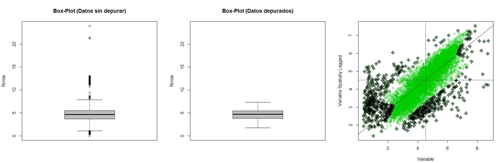
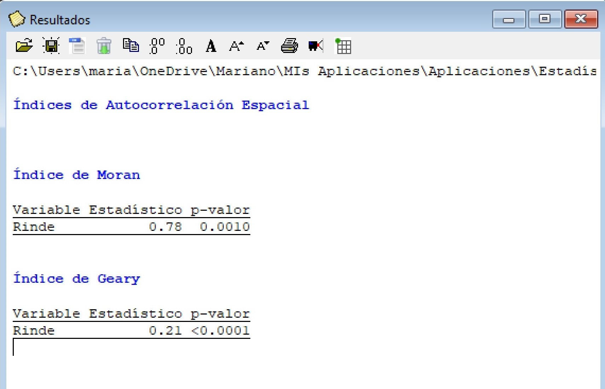
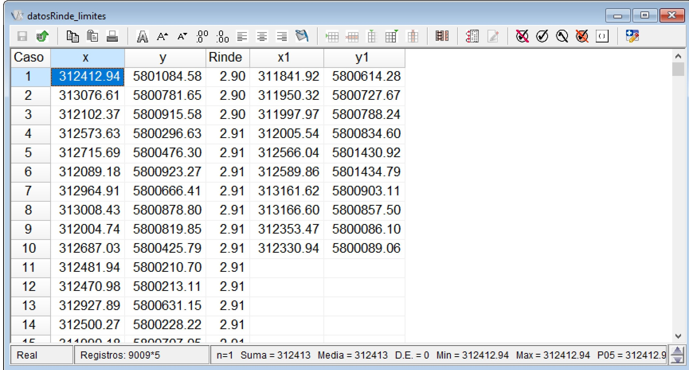
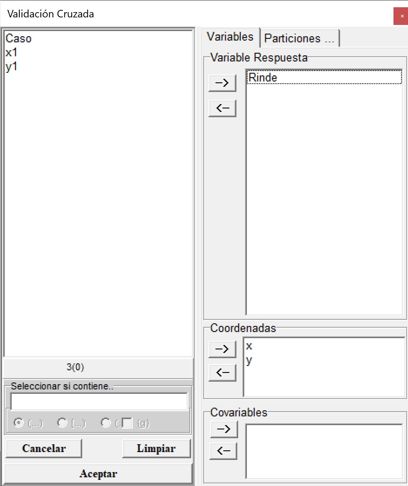
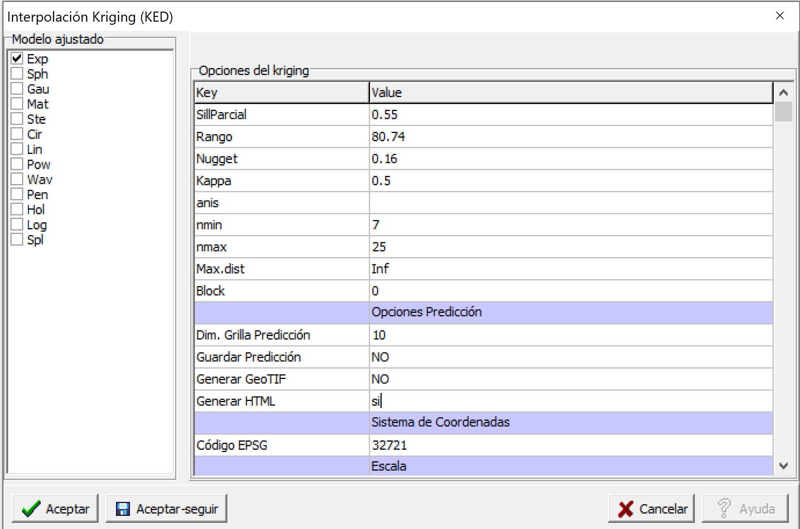
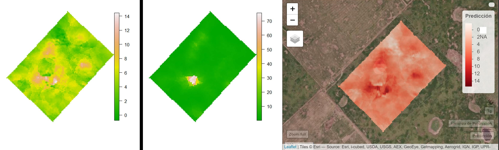

# Implementación con InfoStat

El módulo "Estadística Espacial" de InfoStat permite realizar, a través de su conexión con el software R, la implementación de algoritmos univariados y multivariados para el análisis de datos georreferenciados. En esta sección se ilustrará el uso de este módulo para la transformación de coordenadas, la depuración de datos georreferenciados, el cálculo de índices de autocorrelación espacial, ajuste de semivariogramas, y la obtención de un mapa de variabilidad espacial mediante interpolación kriging. Complementariamente, se ilustra su aplicación con bases de datos de naturaleza multivariada para el cálculo de correlación bivariada, la implementación del análisis de componentes principales espaciales (MULTISPATI-PCA), la clasificación KM-sPC y el uso de métodos de regresión basados en árboles (*Random Forest*). 


## Conversión de coordenadas espaciales

Este menú permite la conversión entre distintos sistemas de coordenadas de referencias basándose en el uso de los códigos EPSG (http://www.epsg.org/). El archivo de datos que se abre desde el menú Aplicaciones $\to$ Estadística Espacial $\to$ Transformación de Coordenadas $\to$ Datos de prueba. El archivo se denomina  **datosRinde.idb2** y contiene 9810 observaciones (registros o filas del archivo) sobre datos de rendimiento de trigo (Rinde, $t\ ha^{-1}$) de un lote agrícola que fueron recolectados con un monitor de rendimiento. Cada valor registrado posee su ubicación geográfica (x e y) en unidades grado decimal que son expresadas en longitud (x) y latitud (y).


```{r, echo = FALSE, purl=FALSE}
knitr::include_graphics("figuras/Parte2/1.jpg")
```


```{r, echo = FALSE, purl=FALSE}
knitr::include_graphics("figuras/Parte2/2.jpg")
```


En el menú Aplicaciones $\to$ Estadística Espacial $\to$ Transformación de Coordenadas $\to$ Run, se abrirá una ventana de selector de variables donde debe indicarse la columna del archivo de datos que contiene la información correspondiente a la Coordenada X y la columna del archivo que contiene la información de la Coordenada Y. Luego, aparecerá una ventana para seleccionar el código EPSG original de los datos y código asignado. En este ejemplo el código original para las coordenadas geográficas WGS84 es 4326 y el asignado para el sistema UTM zona 21 es 32721. En caso de ser necesario previo a esta transformación permite también el pasaje de datos que estén expresados en grados, minutos y segundos a grados decimales. Para ello sólo se debe tildar esta opción en el cuadro de dialogo. Los valores de las coordenadas deben presentarse con un espacio entre subunidades. Por ejemplo "33 1 1" expresan los grados minutos y segundos respectivamente.

```{r VentInfoTransfCoord, echo = FALSE, purl=FALSE, out.width = '0.7\\linewidth'}

```

```{r QecoTransfCoord, echo = FALSE, purl=FALSE}

```


Como resultado, en la tabla de datos original se agregarán dos nuevas columnas, al final del archivo, correspondiente a las coordenadas x e y transformadas, las cuales se denominarán Xt e Yt, haciendo referencia a la variable x transformada (Xt) y a la variable y transformada (Yt). Estas nuevas variables (coordenadas transformadas) permiten interpretar la distancia entre puntos de Rinde en metros. 

```{r, echo = FALSE, purl=FALSE}

```


## Eliminación de *outliers* e *inliers*

En el menú Aplicaciones $\to$ Estadística Espacial $\to$ Depuración $\to$ Datos de prueba se abrirá un archivo denominado **datosRinde_t.idb2** con 9810 registros y tres columnas correspondientes a las coordenadas planas UTM (x e y) de cada observación y los valores de la variable rendimiento de trigo ($t\ ha^{-1}$). Luego, en el menú Aplicaciones $\to$ Estadística Espacial $\to$ Depuración $\to$ Run, se selecciona la variable respuesta, en este ejemplo Rinde y las columnas que indican la ubicación espacial de cada observación en el cuadro de Coordenadas. 


```{r, echo = FALSE, purl=FALSE, out.width = '0.7\\linewidth'}

```


Al accionar el botón *Aceptar*, una nueva ventana permitirá seleccionar si desea visualizar los gráficos *Histograma*, *Box-Plot*, *Red de Vecindarios*, *Visualización espacial* y *Moran Plot*. También existe la opción de tildar que se genere una tabla nueva con los datos depurados, otra tabla con los estadísticos del Índice de Moran y una opción que permite que en la definición de los vecindarios existan algunos puntos que no presenten vecinos. Los valores *inliers* serán identificados a través del Índice de Moran local (*IM local*), *Moran Plot* o ambos (*IM local+Moran Plot*). En la misma ventana hay una opción de seleccionar el valor de desviación estándar (DE) de acuerdo al criterio del usuario. Considerando como valores *outliers* a los que se encuentren fuera del rango estimado como el valor medio ± el valor de DE seleccionado. Por defecto presenta un valor de 3 DE. También el usuario previamente puede limitar los valores de los datos por un valor mínimo y/o máximo. Por defecto este filtro no se aplica.

En este ejemplo se seleccionaron las Opciones *Histograma*, *Box-Plot*, *Visualización espacial*, *Moran plot* y *Tabla datos depurados*. Además, se seleccionó que la eliminación de *inliers* se haga mediante el cálculo del índice de local de Moran y el Moran Plot (*IM local+Moran Plot*). Se utilizó una distancia de 15 para definir los vecindarios y un criterio de 3 DE para la eliminación de *outliers*. Por defecto el código EPSG es 32721 que correspondiente a la base de datos de prueba. En esta rutina el sistema de referencia es importante sólo para realizar la visualización espacial. 

```{r, echo = FALSE, purl=FALSE}
knitr::include_graphics("figuras/Parte2/7.jpg")
```


Como resultado se obtendrá el Box-Plot de la variable respuesta (Rinde) previo a la eliminación de los *outliers* e *inliers* (datos sin depurar), y luego de su eliminación (datos depurados). El gráfico de dispersión de Moran (Moran Plot) muestra en el eje horizontal los valores de la variable rendimiento mientras que en el vertical se representa el retardo espacial de la variable. Los puntos negros con forma romboidal son identificados como influyentes y se los considera como *inliers*.

```{r, echo = FALSE, purl=FALSE}

```

Como resultado de la depuración de datos en la base de datos original se crearán nuevas columnas al final del archivo con la clasificación de *outliers* y/o *inliers* para cada observación. Así, se adicionarán tres columnas denominadas *Outliers*, *Inliers_ML* e *Inliers_MP* según el método seleccionado. Estas variables son de tipo categóricas y contendrán la clasificación *Outliers* o *Normal* indicando si es considerado un valor extremo o no. En la columna de *Inliers_ML*, las categorías serán *Inliers* o *Normal* para indicar que no es un valor atípico respecto a sus vecinos cercanos y de la misma manera se indicarán los valores clasificados por el método de Moran Plot. En este ejemplo, 120 observaciones fueron clasificadas como *outliers*, 43 observaciones como *inliers* y 681 clasificadas como *inliers* según Moran Plot (en los que se encuentran incluidos los 43 casos considerados Inliers por el Índice de Moran Local). El procedimiento primero elimina los *outliers* por lo cual no serán considerados para su identificación como posibles *inliers*. 

```{r, echo = FALSE, purl=FALSE}
knitr::include_graphics("figuras/Parte2/8b.jpg")
```


También se generará una nueva tabla de datos que contendrá las observaciones seleccionadas después de la depuración por *outliers* e *inliers*, que para este ejemplo contiene 9009 registros. Los valores seleccionados se muestran en la tabla denominada **Datos Depurados.idb2**. En caso que el usuario seleccione *Tabla estadísticos IM* se genera otra tabla **Estadísticos IM.idb2**, en la cual sus columnas tendrán los valores de índice local observado (li), el valor esperado (E.li), la varianza (Var.li), el estadístico (Z.li) y la significancia estadística a través del valor-p (Pr.z...0). La información del Moran Plot de los puntos influyentes de la regresión proviene de diferentes estadísticos de diagnóstico como DFBETAS (dfb.1_ para la ordenada al origen y dfb.x para la pendiente), DFFITS (dffit), Covratio (cov.r), distancia de Cook (cook.d) y leverage (hat). Para cada uno de los estadísticos aparecerá una nueva columna del archivo con valores TRUE o FALSE según como ha sido clasificada la observación. En la ventana de Resultados de InfoStat se indica las tablas donde se encuentran estos resultados descriptos. Las nuevas tablas generadas son archivos temporarios, es decir, si desea guardar esta información, deberá ir al menú Archivo $\to$ Guardar tabla y seleccionar el directorio donde desea guardarlo. 
La opción de visualización espacial muestra un gráfico el cual se ejecuta como un archivo html en el navegador web. En este se podrá visualizar los datos detectados como *outliers* e *inliers.* Así mismo es posible cargar un mapa base como *esri.WorldImagery*, *OpenStreetMap*, *OpenTopoMap*.

```{r, echo = FALSE, purl=FALSE}
knitr::include_graphics("figuras/Parte2/9.jpg")
```

## Detección de tendencias espaciales

Un análisis gráfico para identificar de la presencia de tendencias se puede hacer con un gráfico de dispersión. Para ello ir al menú Gráficos $\to$ Diagrama de dispersión. En el casiller *Eje Y* colocar la variable *Rinde* y en *Eje X* la coordenada *x*. Al accionar Aceptar se generará el gráfico que muestra que no existe una tendencia entre ambas variables. El mismo procedimiento deber realizarse con la coordenada *y*. 

```{r, echo = FALSE, purl=FALSE, out.width = '0.7\\linewidth'}
knitr::include_graphics("figuras/Parte2/10.jpg")
```


```{r, echo = FALSE, purl=FALSE, out.width = '100%'}
knitr::include_graphics("figuras/Parte2/11.jpg")
```


También es posible ajustar de un modelo de regresión lineal entre la variable Rendimiento y las coordenadas x e y, se puede realizar yendo al menú Estadísticas $\to$ Regresión Lineal. En el selector de variables se coloca al rendimiento en el casillero de *Variable Dependiente* y las coordenadas x e y en el casillero *Regresoras*.

## Cálculo del índice de Moran

Con la base de datos ya depurada en el punto 2.2 se procederá a calcular índices de autocorrelación espacial. El archivo de ejemplo **datosRinde_dep.idb2** también se encuentra disponible en el menú Aplicaciones $\to$ Estadística Espacial $\to$ Geoestadísticas $\to$ Semivariograma $\to$ WLS $\to$ Datos de prueba. Para cuantificar la magnitud de la estructuración espacial se estiman en este menú el índice de Moran y el índice de Geary. Para ello ir al menú Aplicaciones $\to$ Estadística Espacial $\to$ Geoestadísticas $\to$ Índices de Autocorrelación $\to$ Run. En el selector de variables colocar *Rinde* en el casillero *Variables* (aquí es posible colocar más de una) y en el casillero *Coordenadas* las columnas x e y.

```{r, echo = FALSE, purl=FALSE, out.width = '0.7\\linewidth'}

```

Al accionar *Aceptar* en el siguiente cuadro se puede modificar el número de permutaciones que son utilizadas para evaluar la significancia estadística de los índices a partir de simulación por Monte Carlo. Las ubicaciones son permutadas para obtener la distribución de los índices bajo hipótesis nula de distribución aleatoria. El cálculo también requiere la definición de una matriz de ponderación espacial, para este paso la red de vecindarios es definida usando la distancia Euclídea indicando el rango de distancia dentro de la cual dos observaciones serán consideradas colindantes o vecinas. El rango es estimado a partir de un valor de distancia máximo y uno mínimo. En este ejemplo se utiliza como distancia máxima 15 m. Además, se seleccionó la opción *Datos con vecindario nulo* la cual permite generar la matriz de pesos espaciales sin la restricción de que todos los puntos tengan al menos un dato vecino. 

```{r, echo = FALSE, purl=FALSE}

```

Para este ejemplo, tanto el índice de Moran como el índice de Geary indican una autocorrelación estadísticamente significativa (valor p <0.05), es decir, no hay una distribución aleatoria de las observaciones en el espacio. La variable Rinde presentó una autocorrelación espacial positiva y alta (valor más cercano a 1 en el caso del índice de Moran y mas cercano a 0 en el de Geary sugieren autocorrelaciones positivas más fuerte).


## Análisis basado en semivariogramas

Para acceder al archivo de ejemplo **datosRinde_dep.idb2** se debe ir al menú Aplicaciones $\to$ Estadística Espacial $\to$ Geoestadísticas $\to$ Semivariograma $\to$ WLS $\to$ Datos de prueba. Luego se acciona la opción *Run* siguiendo la misma ruta de acceso. Esta opción realizará el ajuste de un semivariograma empírico y teórico usando el método de mínimos cuadrados ponderados (WLS). En el selector de variables se debe colocar la variable *Rinde* en el casillero *Variables* y en el casillero *Coordenadas* las columnas x e y.

```{r, echo = FALSE, purl=FALSE}
knitr::include_graphics("figuras/Parte2/16.jpg")
```


Al accionar el botón *Aceptar*, aparecerá una nueva ventana donde se podrá seleccionar la función de semivariograma: Exp (exponencial), Sph (esférico), Gau (gaussiano), Mat (Matern), Ste (parametrización de Matern Stein), Cir (circular), Lin (lineal), Pow (potencia o power), Wav (ondulado o wave), Pen (pentaesférico), Hol (holístico o hole), Log (logarítmico) y Spl (spline). Como opciones se puede seleccionar ajustar un semivariograma sin tendencia (*Constante*), con tendencia de primer orden, de segundo orden y con covariable. También es posible indicar los valores iniciales para los parámetros del semivariograma a ajustar (SillParcial, Rango y Nugget). En este ejemplo no se colocaron estos por lo cual la función estima valores iniciales razonable para realizar el ajuste. El parámetro *kappa* es opcional para los modelos Matern y Ste (parametrización de Matern Stein). También, puede ser fijado ingresando un valor en la opción *Kappa*. Si en lugar de colocar un valor numérico se coloca un carácter, se ajustará un *kappa* óptimo en un rango entre 0.05 y 5. La opción de parámetro *width* refiere a la amplitud del intervalo de distancia sobre la cual los pares de puntos agrupados para la estimación de la semivarianza. Por ejemplo, si la distancia máxima entre los pares de puntos es de 1000 y se selecciona un valor de *width*=100, se conformarán 10 grupos de una amplitud de 100 m. Para cada uno de esos 10 grupos se estimará la semivarianza. El *cutoff* es la máxima distancia de separación espacial hasta la cual los pares de puntos son tenidos en cuenta para la estimación de la semivarianza. Si la opción queda vacía, es decir no se coloca ningún valor, por defecto estima el *cutoff* como el tercio de la línea diagonal de una caja que contiene los datos. La función por defecto ajusta un semivariograma isotrópico. Para evaluar si el proceso es anisotrópico es posible el ajuste de semivariogramas direccionales. Esto puede hacer desde el menú Aplicaciones $\to$ Estadística Espacial $\to$ Geoestadísticas $\to$ Semivariograma $\to$ Direccionales. Para incorporar la anisotropía al modelo, en la opción *anis*, se debe colocar la dirección de mayor correlación espacial i.e mayor rango (valor entre 0° y 360°, medidos en el sentido de las agujas del reloj, donde el Norte es 0°.) y el cociente de anisotropía (cociente entre el mayor y el menor rango que se producen en las direcciones evaluadas, valor entre 0 y 1). La dirección y el cociente de anisotropía deben ir separados por coma. El separador de decimales es el punto. Por ejemplo anis=c(90, 0.2) indica que el mayor rango se produce a las 3 en punto (dirección este) con una diferencia de 5 veces en el rango. 

La opción *cressie* permite el ajuste del semivariograma teórico mediante el estimador robusto de Cressie- Hawkins. Para seleccionar este estimador debe colocarse un *si* a esta opción, caso contrario utilizara el estimador de los momentos de Matheron. Esta función permite realizar una validación cruzada el tipo k-fold. Para ello se debe colocar *si* en la opción *Validación*. El número de grupos *k* se coloca en la opción *n-fold*. Además, es posible fijar la semilla para que la asignación de cada dato a los grupos *k* no cambie en caso de repetir el proceso. Las opciones *nmin*, *nmax* y *Max.dist* se utilizan para que la función kriging, usada en el proceso de validación, se realice en un contexto local. Por defecto se definen vecindarios con un número mínimo y máximo de vecinos de cada punto a predecir siendo estos de 7 y 25, respectivamente. En caso de omitir estos últimos argumentos la interpolación se realiza en un contexto global.

En este ejemplo, se ajustó un semivariograma experimental a partir de los datos observados y se probaron los modelos exponencial, esférico y gaussiano como modelos de semivariograma teóricos. Sus parámetros iniciales fueron estimados por defecto por la función. El valor del *cutoff* se fijó en 400 m. Además, se realizó una validación cruzada con k=10. Todas las otras opciones se dejaron por defecto. 
Al accionar *Aceptar* se generan los gráficos con los tres modelos ajustados. La ventana resultados muestra también la información del semivariograma empírico y cada uno de los modelos teóricos ajustados. Además, se proporcionan los valores de los parámetros estimados, criterios de bondad de ajuste (SCE y AIC), y error de predicción de los modelos ajustados. En este ejemplo siguiendo los criterios de SCE y AIC el modelo de mejor ajuste (valores más bajos de estos indicadores) fue el exponencial. Los valores de los parámetros fueron: Sill Parcial=0,86, rango=64,88, efecto Nugget=0,21. Los resultados de la validación cruzada muestran pequeñas diferencias entre los errores de predicción de los modelos ajustados. Para el caso del modelo exponencial la RMSE relativa a la media de los valores observados (nRMSE) fue del 11,82\% mientras cociente de la desviación cuadrática media (MSDR) fue de 0,60 (más cercano a 1 mejor modelo). 

```{r, echo = FALSE, purl=FALSE}

```

```{r, echo = FALSE, purl=FALSE}
knitr::include_graphics("figuras/Parte2/18.jpg")
```


### Mapeo de variabilidad espacial

Para realizar la interpolación espacial mediante kriging se utilizará la base de datos **datosRinde_limites.idb2** que se encuentra en el menú Aplicaciones $\to$ Estadística Espacial $\to$ Geoestadísticas $\to$ Interpolación $\to$ Kriging $\to$ Datos de prueba. El archivo de datos contiene además de las coordenadas (x e y), la variable respuesta (Rinde) y dos nuevas columnas (x1 e y1) que contienen los vértices del polígono donde se desea realizar la interpolación. Estas últimas no son obligatorias para realizar la interpolación. En caso de omitirse la función tomara los puntos más externos de la base de datos y a partir de este formara un polígono que definirán los límites del área a interpolar. 


```{r, echo = FALSE, purl=FALSE}

```

Si se vuelve a la misma ruta de accesos y se acciona *Run* se abrirá el selector de variables donde se colocará la variable *Rinde* en el casillero *Variable Respuesta*, x e y en *Coordenadas* y las columnas x1 e y1 en los casilleros *Coord. Vértices X* y *Coord. Vértices Y*, respectivamente.

```{r, echo = FALSE, purl=FALSE, out.width = '0.7\\linewidth'}
knitr::include_graphics("figuras/Parte2/20.jpg")
```


Luego de accionar *Aceptar*, se genera una ventana con diferentes opciones para seleccionar el tipo de modelo ajustado (Exp, Sph, Gau, Ste, Cir, Lin, Pow, Wav, Pen, Hol, Log, y Spl), el tipo de kriging, ordinario sin tendencia o universal (incorporando la tendencia en primer o segundo orden) y los valores para realizar la predicción espacial. En este caso se utilizará el modelo seleccionado en el punto anterior. Así, se selecciona el modelo exponencial y se fijan los valores de los parámetros Sill Parcial=0.86, rango=64,88, efecto Nugget=0.21. En este caso la predicción se realiza en un contexto local (opción por defecto). Para ello se fija un número mínimo (*nmin*) y máximo (*nmax*) de puntos que son utilizados para realizar la predicción en cada uno de los sitios de la grilla de predicción. Otra opción para determinar cuáles son los puntos que aportan información para la predicción de un sitio determinado es usando una medida de distancia (*Max.dist*). Puntos que se ubican más allá de la distancia máxima determinada por el usuario respecto a la posición sobre la que se quiere predecir el valor de la respuesta, no serán utilizados para la predicción. En caso de requerir que la predicción se realice utilizando toda la información disponible (kriging global), las opciones *nmin*, *nmax* y *Max.dist* se dejan vacías. La predicción también puede realizarse de manera puntual o en bloque. En este ejemplo donde bloque (Block) es cero, la predicción será local.

Para realizar la predicción se requiere definir los puntos donde se realiza la interpolación en *Opciones de Predicción*. Con *Dim. Grilla Predicción* se fija la dimensión de la grilla de predicción, en este caso, 10 indica que tiene una dimensión de 10×10 m. También puede fijarse el sistema de coordenadas que tendrán los mapas generados usando el código EPSG. Para estos datos el código es 32721 que corresponde al sistema de coordenadas UTM, zona 21, hemisferio sur. Esto es importante para proyectar correctamente los mapas generados. Es posible visualizar estos mapas en el navegador web colocando *si* en la opción *Generar HTML* o exportarlos como geotiff (opción *Generar GeoTIF*). En caso de colocar *si* en esta última opción el software abrirá una ventana para elegir el directorio en el cual se guardará el archivo generado. Los valores de la predicción también pueden ser colocados en forma de tabla mediante la opción *Guardar Predicción*. Finalmente, también es posible cambiar los valores mínimos y máximos de las escalas de valores de los mapas que se generan (Predicción y Varianza de Predicción).

```{r, echo = FALSE, purl=FALSE}
knitr::include_graphics("figuras/Parte2/21.jpg")
```

```{r, echo = FALSE, purl=FALSE}
knitr::include_graphics("figuras/Parte2/22.jpg")
```

```{r, echo = FALSE, purl=FALSE}

```


### Validación cruzada

La evaluación de la capacidad predictiva de los modelos ajustados que se realizó en el punto 2.5, también puede realizarse desde el menú Aplicaciones $\to$ Estadística Espacial $\to$ Geoestadísticas $\to$ Interpolación $\to$ Validación Cruzada. En el selector de variables se coloca la variable *Rinde* en el casillero *Variable Respuesta* y las coordenadas en el cuadro *Coordenadas*. 

```{r, echo = FALSE, purl=FALSE, out.width = '0.7\\linewidth'}

```

En la siguiente ventana se coloca la información del modelo a evaluar, en este caso exponencial con parámetros Sill Parcial= 0.86, rango=64.88 y efecto Nugget=0.21. La predicción kriging se realiza en un contexto local (opción por defecto) con *nmin*=7 y *nmax*=25. El número de grupos de la validación cruzada es de k=10. La función permite también calcular el error de predicción para kriging universal (tendencias de primer y segundo orden) y kriging con deriva externa. 

```{r, echo = FALSE, purl=FALSE}
knitr::include_graphics("figuras/Parte2/25.jpg")
```

Para este ejemplo la RMSE relativa a la media de los valores observados (nRMSE) fue del 10,27\% mientras cociente de la desviación cuadrática media (MSDR) fue de 0.66 (más cercano a 1 mejor modelo). 

```{r, echo = FALSE, purl=FALSE}
knitr::include_graphics("figuras/Parte2/26.jpg")
```

## Caracterización de variabilidad espacial con múltiples capas de datos


### Análisis de componentes principales

La base de datos **Pred2.idb2** se encuentra disponible en el menú Aplicaciones $\to$ Estadística Espacial $\to$ Geoestadísticas $\to$ Multivariado $\to$ a. MULTISPATI-PCA $\to$ Datos de prueba. En el selector de variables se colocan las variables Pe, Elev, CE30, CE90 y Tg en el cuadro *Variables* y las coordenadas x e y en *Coordenadas*.

```{r, echo = FALSE, purl=FALSE, out.width = '0.7\\linewidth'}
knitr::include_graphics("figuras/Parte2/27.jpg")
```

En la siguiente ventana se presentan las opciones del MULTISPATI-PCA. Aquí se puede seleccionar estandarizar las variables (opción por defecto), generara gráficos (biplot del PCA, gráfico de la red de vecindarios, gráficos del MULTISPATI-PCA y gráfico de los autovalores) y solicitar que la conformación de la matriz de pesos espaciales admita datos con vecindarios nulo. Las otras opciones del análisis implican fijar el número de ejes retenidos por el PCA y por el MULTISPATI-PCA. Para este último caso pueden ser aquellos que presenten una autocorrelación positiva (*MULTISPATI-PCA (+)*) o negativa (*MULTISPATI-PCA (-)*). La parametrización para este ejemplo se muestra en la siguiente figura:

```{r, echo = FALSE, purl=FALSE}
knitr::include_graphics("figuras/Parte2/28.jpg")
```

El gráfico obtenido del MULTISPATI-PCA muestra que las variables Elev y Pe son las más importantes en la explicación de la variabilidad espacial a nivel del primer eje (sPC1, eje horizontal). Mientras que la CE30 y Tg presentan mayor importancia en la SPC2. Además, se observa una correlación positiva entre CE30 y CE90, y negativa entre estas dos y la Pe. También la Elev y Tg se correlacionan en forma negativa. 

```{r, echo = FALSE, purl=FALSE}
knitr::include_graphics("figuras/Parte2/29.jpg")
```

Los resultados muestran que con MULTISPATIPCA se explica una menor proporción de la varianza acumulada en el primer eje, respecto de PCA (1,81 vs. 1,94). Las tres primeras CP del PCA explican 78\% de la variabilidad total mientras que la CS1, CS2 CS3 del MULTISPATI el 73\%. No obstante, los valores del índice de Moran calculados para las tres primeras CPs sugieren que la estimación de autocorrelación aumentó cuando se usó MULTISPATIPCA respecto de la contenida en las CPs del PCA (0,79 vs. 0,68 para el eje 1, 0,43 vs. 0,40 para el eje 2, 0,50 vs. 0,25 para el eje 3). 

```{r, echo = FALSE, purl=FALSE}

```

### Análisis de conglomerados 

Para realizar la ilustración se utilizará la base de datos **Pred.idb2** que se encuentra en el menú Aplicaciones $\to$ Estadística Espacial $\to$ Geoestadísticas $\to$ Multivariado $\to$ c. Clasificación KMsPC $\to$ Datos de prueba. El archivo de datos contiene además de las coordenadas (x e y), valores de mediciones de conductividad eléctrica aparente en dos profundidades 0-30 cm (CE30) y 0-90 cm (CE90), elevación (Elev), profundidad de suelo (Pe) y rendimiento de trigo (Tg). Las variables CE30, CE90, Elev Pe y Tg se colocan en el casillero *Variables* y las coordenadas x e y en el cuadro *Coordenadas*.


```{r, echo = FALSE, purl=FALSE, out.width = '0.7\\linewidth'}

```


Al accionar *Aceptar*, aparecerá la ventana para seleccionar opciones del método de análisis. El método KM-sPC primero realiza un análisis de componentes principales espaciales (MULTISPATI-PCA) sobre las variables originales. Luego las variables sintéticas (componentes principales espaciales, sPC) son utilizadas como input del análisis de clúster fuzzy k-means. Por ello, es posible estandarizar las variables para realizar el MULTISPATI-PCA y elegir la opción que permite conformar una matriz de pesos espaciales en presencia de datos con vecindarios nulo. Otras opciones del análisis incluyen la distancia (euclídea o manhattan) utilizada en el método de cluster, el número mínimo y máximo de clúster a generar, el número de iteraciones y el exponente difuso. En este ejemplo se usaron las siguientes opciones: 2 hasta 6 cluster, 100 iteraciones y un valor de 1.3 para el exponente difuso. Para el cálculo de la red de vecindarios, necesario para realizar el MULTISPATI-PCA, la distancia mínima y máxima fue de 0 y 10 m, respectivamente. La opción de varianza explicada (\%) fue del 70, lo que indica que seleccione la cantidad de ejes (componentes principales espaciales) necesarios tal que la varianza total explicada sea mayor o igual a 70\%.


```{r, echo = FALSE, purl=FALSE}

```


En la ventana resultados se muestra la suma de cuadrados de distancias dentro (SCDD) la cual puede usarse para determinar el número de clúster óptimo. Para esto otros índices son calculados como Xie-Beni, Fukuyama Sugeno, Coeficiente de Partición, Entropía de Partición. Para todos ellos un menor valor del índice implica mejor clasificación. Dado que muchas veces los índices no coinciden se adiciona el cálculo de un índice resumen. Los resultados muestran que, para la mayoría de los índices, incluyendo el resumen, el número de clúster optimo es 2. Cuando se ejecuta el análisis los índices también son graficados en forma conjunta usando una escala normalizada. En este caso también un menor valor del índice en la escala normalizada implica una mejor clasificación.

```{r, echo = FALSE, purl=FALSE}
knitr::include_graphics("figuras/Parte2/33.jpg")
```

```{r, echo = FALSE, purl=FALSE}

```

## Predicción con múltiples capas de datos

Los datos de ilustración **Pred2.idb2** serán utilizados para cada de las alternativas de predicción disponibles en el menú. El archivo de datos contiene además de las coordenadas (x e y), valores de mediciones de conductividad eléctrica aparente en dos profundidades 0-30 cm (CE30) y 0-90 cm (CE90), elevación (Elev), profundidad de suelo (Pe) y rendimiento de trigo (Tg).

### Kriging con deriva externa

El acceso al menú es a partir de las opciones: Aplicaciones $\to$ Estadística Espacial $\to$ Geoestadísticas $\to$ Interpolación $\to$ c. Kriging (KED) $\to$ Datos de prueba.  Para realizar la interpolación se necesita de una grilla de predicción previamente generada en formato de archivo .txt que cuente con la información de las coordenadas (x e y) en las dos primeras columnas y de cada una de las covariables que se usaron en el ajuste del modelo. Se requiere que los nombres de las covariables sean los mismos tanto en la grilla de predicción como en la tabla de observaciones. El archivo **grilla_am.txt** contiene esta información.

En primer lugar se procede al ajuste de los semivariograma experimental teórico. Para ello se accede al menú Aplicaciones $\to$ Estadística Espacial $\to$ Geoestadísticas $\to$ b. Semivariograma $\to$ WLS $\to$ Run. Las variables CE30, CE90, Elev Pe y Tg se colocan en el casillero *Variables*, las coordenadas x e y en el cuadro *Coordenadas* y Pe, Elev, CE30 y CE90 en el cuadro *Covariables*.

```{r, echo = FALSE, purl=FALSE, out.width = '0.7\\linewidth'}
knitr::include_graphics("figuras/Parte2/35.jpg")
```

En la siguiente ventana se seleccionan los modelos teóricos a ajustar, en este ejemplo exponencial esférico y gaussiano. En la opción *Tendencia* se selecciona *Covariables*. Las otras opciones de ajuste de los semivariogramas se dejan por defecto. Los resultados muestran que el modelo de mejor ajuste según los valores de SCE y AIC es el exponencial. Los semivariogramas teóricos ajustados se despliegan en forma automática.

```{r, echo = FALSE, purl=FALSE}
knitr::include_graphics("figuras/Parte2/36.jpg")
```


```{r, echo = FALSE, purl=FALSE}
knitr::include_graphics("figuras/Parte2/37.jpg")
```


```{r, echo = FALSE, purl=FALSE}
knitr::include_graphics("figuras/Parte2/38.jpg")
```


Con los valores de los parámetros estimados del semivariograma exponencial se procede a realizar la interpolación espacial. Para ello se accede al menú Aplicaciones $\to$ Estadística Espacial $\to$ Geoestadísticas $\to$ Interpolación $\to$ c. Kriging (KED) $\to$ Run. Las variables CE30, CE90, Elev Pe y Tg se colocan en el casillero *Variables*, las coordenadas x e y en el cuadro *Coordenadas* y Pe, Elev, CE30 y CE90 en el cuadro *Covariables*.

```{r, echo = FALSE, purl=FALSE, out.width = '0.7\\linewidth'}

```

En la ventana siguiente se selecciona el modelo de semivariograma exponencial y se colocan los valores de los parámetros estimados en el paso anterior. En este ejemplo se selecciona la opción para mostrar el mapa de predicción en una ventana del navegador web (opción *Generar HTML*). Para ello es importante fijar el sistema de coordenada mediante el código EPSG. 

```{r, echo = FALSE, purl=FALSE}

```

Al *Aceptar* se abrirá una ventana que permite seleccionar la grilla de predicción que en este ejemplo se denomina **grilla_am.txt**. Posteriormente se generarán los mapas de predicción y varianza de predicción.

```{r, echo = FALSE, purl=FALSE}

```

```{r, echo = FALSE, purl=FALSE}

```


### Kriging desde modelo de regresión

El acceso al menu es a partir de las opciones: Aplicaciones $\to$ Estadística Espacial $\to$ Geoestadísticas $\to$ Interpolación $\to$ c. Regression Kriging $\to$ Datos de prueba. Las variables CE30, CE90, Elev Pe y Tg se colocan en el casillero *Variables* y las coordenadas x e y en el cuadro *Coordenadas*.

```{r, echo = FALSE, purl=FALSE, out.width = '0.7\\linewidth'}

```

En la ventana siguiente se puede seleccionar que el método sólo realice la predicción en base al ajuste de un modelo de regresión lineal o sumando a la predicción los valores interpolados usando kriging ordinario de los residuos del modelo de regresión (*Regresión Lineal + kriging Ordinario*). La función ajusta en forma automática el semivariograma experimental y los modelos teóricos exponencial, esférico y gaussiano. Luego, selecciona el de mejor ajuste según el valor de SCE, y los parámetros de este son usados en la interpolación de los residuos. El método también permite realizar una selección de variables paso a paso (*stepwise*) en ambas direcciones usando el criterio de información de Akaike para evaluar el ajuste de los modelos. Otras opciones incluyen la posibilidad de realizar una validación cruzada k-fold, donde se debe especificar el valor de k y un valor para la semilla. Para ello es necesario colocar *si* en la opción *Evaluar*. También es posible guardar los valores predichos (opción *Predichos*) y obtener la predicción (opción *Predecir*) sobre una nueva base de datos. Para esto se necesita tener un archivo .txt con la información de las coordenadas (x e y) en las dos primeras columnas y de cada una de las covariables que se usaron en el ajuste del modelo. Se requiere que los nombres de las covariables sean los mismos tanto en la grilla como en la tabla de datos. La opción *Importancia* permite elaborar un ranking de la importancia relativa de cada covariable en el modelo ajustado. Esta se calcula en función a la influencia que tiene cada predictor en Error Cuadrático Medio (MSE) del modelo mediante un proceso de permutación de los valores de cada covariable.

```{r, echo = FALSE, purl=FALSE, out.width = '0.7\\linewidth'}

```

Al ejecutar el análisis, dado que se solicitó realizar la predicción, el software mostrará una ventana para seleccionar el archivo .txt que corresponde a la grilla de predicción. En este ejemplo se denomina **grilla_am.txt**. Al accionar *Abrir* se procederá con el análisis. En la ventana *Resultados* se menciona que los valores *Predichos* se adicionan a la tabla de datos **Pred2.idb2**. Además, los valores de la predicción se adicionan a la grilla y se despliegan en una nueva tabla de datos denominada *Predicción*.

```{r, echo = FALSE, purl=FALSE}
knitr::include_graphics("figuras/Parte2/45.jpg")
```

```{r, echo = FALSE, purl=FALSE}
knitr::include_graphics("figuras/Parte2/46.jpg")
```

Los resultados muestran las medidas para cuantificar el error de predicción, entre estas el error medio absoluto (MAE), la raíz del error cuadrático medio (RMSE), la RMSE relativa a la media de los observados (nRMSE) y un valor de $R^2$. Los valores muestran un mejor desempeño del kriging regresión vs. el modelo de regresión lineal múltiple. En el ranking de importancia de las variables explicativas se observa que la elevación fue la variable que contribuyo en mayor medida a explicar la variabilidad del rendimiento de trigo. El semivariograma ajustado sobre los residuos del modelo de regresión lineal muestra la existencia de una estructura de correlación espacial (bajo valor del cociente nugget\/sill). 

<!-- ```{r, echo = FALSE, purl=FALSE} -->
<!--  -->
<!-- ``` -->


### Árboles aleatorios

Para realizar el análisis las variables CE30, CE90, Elev Pe y Tg se colocan en el casillero *Variables* y las coordenadas x e y en el cuadro *Coordenadas*.

```{r, echo = FALSE, purl=FALSE, out.width = '0.7\\linewidth'}
knitr::include_graphics("figuras/Parte2/48.jpg")
``` 

En la ventana siguiente se puede seleccionar que el método sólo realice la predicción en base al algoritmo *Random Forest* o sumando a la predicción de este los valores interpolados usando kriging ordinario de los residuos del Random Forest (*Random Forest + kriging Ordinario*).  Luego, selecciona el de mejor ajuste según el valor de SCE, y los parámetros de este son usados en la interpolación de los residuos. La función ajusta en forma automática el semivariograma experimental y los modelos teóricos exponencial, esférico y gaussiano. El método también permite fijar un valor del hiperparámetro *mtry* del random forest o también realizar una selección del *mtry* optimo mediante un proceso de validación cruzada del tipo k-fold. Para la validación se puede especificar el valor de k y un valor de semilla. En caso de no fijar el valor de *mtry* utiliza el recomendado de $p/3$ para modelos de regresión o $\sqrt{p}$ para modelos de clasificación. Si se quiere probar más de un valor se puede especificar un vector de valores que inician con el valor colocado en la opción *Desde* hasta el valor especificado en *Hasta* con un salto dado por la opción *Paso*. La opción *Evaluar* permite realizar una validación cruzada de la misma forma que la especificada inicialmente. Para ello es necesario colocar *si* en dicha opción. 

También, es posible guardar los valores predichos (opción *Predichos*) y obtener la predicción (opción *Predecir*) sobre una nueva base de datos. Para tal fin se necesita tener un archivo .txt de la grilla de predicción con la información de las coordenadas (x e y) en las dos primeras columnas y de cada una de las covariables que se usaron en el ajuste del modelo. Se requiere que los nombres de las covariables sean los mismos tanto en la grilla como en la tabla de datos. La opción *Importancia* devuelve un ranking de la importancia relativa de cada covariable en el modelo ajustado, que se calcula en función a la influencia que tiene cada predictor en Error Cuadrático Medio (MSE) del modelo mediante un proceso de permutación de los valores de cada covariable. La opción *Relaciones Parciales* generar un gráfico que muestra el efecto marginal de cada una de las covariables sobre la variable respuesta. Para obtener este gráfico debe colocarse *si*. Esto genera un  panel con los gráficos de cada una de las covaraiables del modelo. Si en lugar de *si* se coloca el carácter *m* el método genera un gráfico independiente para cada una de las regresoras. También, es posible editar los valores mínimos y máximos de la variable respuesta (eje y) en todos los gráficos mediante las opciones *ymin* e *ymax*.

```{r, echo = FALSE, purl=FALSE, out.width = '0.7\\linewidth'}

``` 

Al ejecutar el análisis, dado que se solicitó realizar la predicción, el software mostrará una ventana para seleccionar el archivo .txt que corresponde a la grilla de predicción. En este ejemplo se denomina **grilla_am.txt**. Al accionar *Abrir* se procederá con el análisis. En la ventana *Resultados* se menciona que los valores *Predichos* se adicionan a la tabla de datos **Pred2.idb2**. Además, los valores de la predicción se adicionan a la grilla y se despliegan en una nueva tabla de datos denominada *Predicción*.

```{r, echo = FALSE, purl=FALSE}
knitr::include_graphics("figuras/Parte2/50.jpg")
``` 


```{r, echo = FALSE, purl=FALSE}
knitr::include_graphics("figuras/Parte2/51.jpg")
``` 

Los resultados muestran las medidas para cuantificar el error de predicción, entre estas el error medio absoluto (MAE), la raíz del error cuadrático medio (RMSE), la RMSE relativa a la media de los observados (nRMSE) y un valor de $R^2$. Los valores muestran un mejor desempeño del kriging regresión vs. el modelo de regresión lineal múltiple. En el ranking de importancia de las variables explicativas se observa que la elevación fue la mayor contribución en la determinación del rendimiento de trigo. El gráfico de las relaciones parciales muestra que cuando aumenta la elevación disminuye el rendimiento de trigo. Con la variable Pe la correlación es negativa mientras que con la conductividad eléctrica presenta una relación no lineal. El semivariograma ajustado sobre los residuos del modelo de regresión lineal muestran la existencia de una estructura de correlación espacial (bajo valor del cociente nugget\/sill). 


```{r, echo = FALSE, purl=FALSE}
knitr::include_graphics("figuras/Parte2/52.jpg")
``` 

```{r, echo = FALSE, purl=FALSE}

``` 

