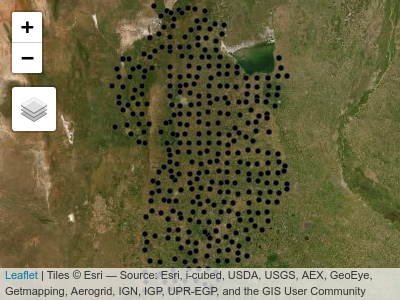

\cleardoublepage 

# (PART) Análisis de datos a escala regional {-}

\setcounter{chapter}{0}

# Bases de datos regionales

Muchos procesos aleatorios varían de manera continua en el espacio a escala regional. Entonces, es de interés predecir el comportamiento de una variable en referencia a su ubicación geográfica. En algunas situaciones además de la distribución en el espacio otras capas de información (covariables de sitio) pueden ser usadas para mejorar la predicción en un sitio específico. En esta parte se ilustran el manejo de datos espaciales para la predicción a escala regional de una variable a partir de múltiples capas de información y la construcción de un modelo de predicción espacial vía estrategias metodológicas alternativas: regresión múltiple vía REML, regresión múltiple vía INLA y regresión no lineal vía modelo basado en árbol. 

Como ejemplo se utiliza la base de datos **suelos_cba.txt**. Esta es una parte del SIG de los suelos del horizonte superficial de la provincia Córdoba [@Hang2015], que contiene 350 sitios caracterizados por múltiples variables edáficas que describen los primeros 15 cm de profundidad. Las variables presentes en **suelos_cba.txt** son: COS (Carbono Orgánico de Suelo, g\/kg) arcilla (\%), pH, elevación (m.s.n.m.), twi (Índice Topográfico de Humedad). El objetivo del análisis es ajustar modelos que expliquen la variabilidad espacial de COS en función de las restantes variables en la base de datos.

Para seguir la ilustración, cargar los paquetes específicos de R que albergan las funciones que se utilizarán tanto para el manejo como para la modelación.

```{r, eval = FALSE, echo = FALSE}
tryCatch(
  library(INLA),
  error = function (e) {
    install.packages(
      "INLA",
      repos = c(getOption("repos"), INLA = "https://inla.r-inla-download.org/R/stable"),
      dep = TRUE
    )
  }
)

```


```{r, message=FALSE}
library(sf)
library(raster)
library(tmap)
library(nlme)
library(INLA)
library(caret)
library(gstat)
```


```{r, echo=FALSE, purl=FALSE}
INLA:::inla.dynload.workaround()

load("codigos/mallas.RData")

```


## Manejo de datos espaciales

Mediante la función `read.table()` se lee un archivo de texto que se guarda como un objeto denominado `suelos`, en el cual las columnas están separadas por tabuladores y la primera fila contiene los nombres de columnas. Mediante la función `head()` se visualizan las primeras filas del objeto `suelos` donde se observa que la primera columna corresponde a una identificación, las siguientes dos son las coordenadas X e Y las cuales corresponden al sistema de proyección UTM faja 20. Las columnas siguientes contienen las variables en estudio.


```{r}
suelos <- read.table("datos/suelos_cba.txt", 
                     sep = "\t", header = TRUE)
head(suelos)
```


Para transformar este objeto en uno de clase espacial, se utilizará la función `st_as_sf()`, especificando que las coordenadas X e Y, se encuentra en las columnas "X" e "Y", respectivamente. Todos los sistemas de coordenadas tienen asociados un código que los identifica y que a través del cual, se pueden conocer los parámetros asociados al mismo, este código se llama EPSG por su acrónimo en inglés. El código EPSG del sistema de referencia y proyección de la base de datos es 32720. El objeto `suelos_sf`, ahora es un objeto espacial de clase `sf`, donde cada observación corresponde a cada sitio de muestreo. Se muestra el sistema de referencia y proyección de las coordenadas y el tipo de geometría.


```{r}
suelos_sf <- st_as_sf(suelos, 
                      coords = c("X", "Y"), 
                      crs = 32720)
suelos_sf
```

Para explorar los datos se usa el paquete `tmap` que permite realizar gráficos estáticos o dinámicos. Con la opción dinámica, se puede interactuar con el gráfico de manera análoga a un SIG. Para cada gráfico, se comienza utilizando la función `tm_shape()` especificando el objeto a graficar. Cada observación se grafica un punto mediante la función `tm_dots()`, cada nivel se agrega mediante el símbolo `+`.

```{r}
tm_shape(suelos_sf) + 
  tm_dots()
```

Para agregar latitud y longitud a esta figura se realiza una reproyección. En la función `tm_shape()` se especifica el nuevo sistema de coordenadas con el que se desea graficar (argumento `projection`). Se agregar el nivel `tm_grid()` para visualizar una grilla que contiene las coordenadas latitud y longitud. 

```{r}
tm_shape(suelos_sf, projection = 4326) + 
  tm_grid(col="grey90") +
  tm_dots()
```

Cualquiera de estos gráficos se puede convertir en un gráfico dinámico mediante la función `tmap_mode()` especificando como argumento `"view"`. Para continuar con gráficos estáticos se debe especificar `"plot"` como argumento de esta función. Mediante la función `tm_basemap()`, se pueden incorporar distintas capas base. Las opciones disponibles para las capas base se pueden ver mediante el comando `names(leaflet::providers)`. 

Cualquiera de estos gráficos se puede convertir en un gráfico dinámico utilizando la función `tmap_mode()` especificando como argumento `"view"`. Para continuar con gráficos estáticos se debe especificar `"plot"` como argumento de esta función. Mediante la función `tm_basemap()`, se pueden incorporar distintas capas base (capas de fondo que ayudan a visualizar). Las opciones disponibles para las capas base se pueden ver mediante el comando `names(leaflet::providers)`.


```{r suelossftmap, eval=FALSE}

tmap_mode("view")

tm_shape(suelos_sf) +
  tm_dots() +
  tm_basemap("Esri.WorldImagery", "OpenTopoMap")

```


```{r, echo = FALSE, purl=FALSE}

```


```{r, echo=FALSE, message=FALSE, eval=FALSE}
tmap_mode("plot")
```

## Confección de grillas de predicción

Para generar esta grilla es necesario definir una resolución espacial en el área de interés. Para este ejemplo, se utiliza un archivo vectorial, **limites_cba.shp**, el cual define el límite del territorio sobre el que se desea predecir.


```{r, message=FALSE}
limites_cba <- st_read("datos/limites_cba.shp",
                       quiet = TRUE)
limites_cba <- st_transform(limites_cba, 
                            crs = 32720)
```

La función `st_make_grid()` genera una grilla rectangular conteniendo el área del objeto `limites_cba`. Para definir la resolución espacial de la grilla se utiliza el argumento `cellsize` definiendo un tamaño de grilla en relación con la unidad de medida del sistema de coordenadas, en este caso 10000 metros, dado que está en UTM.

```{r}
grilla_base <- st_make_grid(limites_cba, 
                            cellsize = 10000)

tm_shape(grilla_base) +
  tm_borders() +
  tm_shape(limites_cba) +
  tm_borders(col = "red")

```


Dado que la grilla es rectangular, es necesario cortarla según los límites. Para esto se realiza una intersección entre los límites y la grilla utilizando la función `st_intersection()`.

```{r, warning=FALSE}
grilla_pred <- st_intersection(limites_cba,
                               grilla_base)

tm_shape(grilla_pred) +
  tm_borders()
```

Los algoritmos de predicción implementados trabajan prediciendo sitios puntuales, por lo cual, a partir de la grilla, es necesario generar una grilla de puntos. Una alternativa es utilizar la función `st_centroid()` para obtener el centroide de cada celda.

```{r}
centroide_pred <- st_centroid(grilla_pred)

tm_shape(centroide_pred) +
  tm_dots()
```


## Agregado de capas de información

Se presenta los comandos necesarios para combinar múltiples capas de información en un mismo objeto. Las variables elevación y twi son extraídas desde modelos digitales de elevación, que se encuentran en formato raster. El paquete `raster` de R es específico para lectura y manipulación de este tipo de archivos. Para leer un archivo de este formato, se puede utilizar la función `raster()` mientras que para reproyectar se utiliza la función `projectRaster()`. El archivo **elevacion.tif** contiene datos de elevación para la provincia de Córdoba. Cuando se imprime el objeto, se muestra la cantidad de pixeles por fila, columna, pixeles totales, la resolución espacial, las coordenadas extremas en latitud y longitud, el sistema de coordenadas de referencia, los valores mínimo y máximo de la variable observada.

```{r}
elevacion <- raster("datos/elevacion.tif")
elevacion <-
  projectRaster(elevacion, 
                crs = "+proj=utm +zone=20 +south 
                +datum=WGS84 +units=m +no_defs")
elevacion
```

Para obtener en los sitios de predicción el valor de la variable del objeto raster, se utiliza la función `extract()` definiendo como argumento el nombre del objeto raster y el nombre del objeto vectorial que contiene los sitios. Estos valores extraídos se adicionan en una columna llamada `elevacion` dentro del objeto `centroide_pred` utilizando el símbolo `$`.

```{r}
centroide_pred$elevacion <-
  raster::extract(elevacion, centroide_pred)
```


El archivo **twi.tif** contiene valores de un índice topográfico de humedad también generado a partir de datos provenientes de un modelo digital de elevación.. 

```{r}
twi <- raster("datos/twi.tif")
twi <-
  projectRaster(twi, 
                crs = "+proj=utm +zone=20 +south
                +datum=WGS84 +units=m +no_defs")
twi
```

Utilizando la función `extract()` se extrae los valores de TWI para cada sitio de la grilla de predicción.

```{r}
centroide_pred$twi <-
  raster::extract(twi, 
                  centroide_pred)

```


Se adiciona a la grilla variables procedentes de otras fuentes (SIG de muestreo de suelo). Estos datos se encuentran en los archivos raster llamados **arcilla.tif** y **pH.tif**, respectivamente. Estos raster tienen la misma resolución espacial y extensión, por lo que es posible superponerlos en un mismo objeto mediante la función `stack()`.

```{r}
arcilla <- raster("datos/arcilla.tif")
pH <- raster("datos/pH.tif")
edaf <- stack(pH, arcilla)
projection(edaf) <-
  "+proj=utm +zone=20 +south
   +datum=WGS84 +units=m +no_defs"

tm_shape(edaf) +
  tm_raster()

```


Se seleccionan los valores de los sitios utilizando la función `extract()`. Como los valores extraídos mediante la funcion desde un *stack* de rasters genera un objeto de tipo `data.frame` con tantas columnas como capas contenga ese raster, se adicionan al objeto `centroide_pred` mediante la función `cbind()`, la cual une columnas de igual número de filas. Ahora el objeto `cetroide_pred` contiene todos los sitios de predicción con las variables auxiliares adicionadas.

```{r}
edaf_pred <- raster::extract(edaf, 
                             centroide_pred)
centroide_pred <- cbind(centroide_pred, 
                        edaf_pred)
centroide_pred
```

Para identificar la variación de la variable de interés en un plano, se puede usar una escala de colores. La elección de la escala cambia según los colores y los puntos de corte (valores de la variable de interés en los cuales cambia el color). Para definirla algunas opciones automáticamente identifican los valores para categorizar y asignar un color. Por defecto, `tmap` categoriza los valores en intervalos fijos. Utilizando el argumento `style`, se puede modificar el método a utilizar. Las opciones `style = "order"` y `style = "cont"` permiten representar variables numéricas en un gradiente de color. La opción "order" realiza una escala en función del ranking de los valores, permitiendo una mejor visualización de variables asimétricas. Para la visualización de más de un mapa generado con `tmap` en un mismo gráfico, se puede utilizar la función `tmap_arrange()`, utilizando como argumento los mapas que se quieren visualizar. El argumento `sync = TRUE` permite la visualización interactiva con la navegación (zoom y movimiento) sincronizada en ambos mapas. 


```{r}
elevTm <- tm_shape(centroide_pred) +
  tm_dots("elevacion", style = "order")

twiTm <- tm_shape(centroide_pred) +
  tm_dots("twi", style = "cont")

pHTM <- tm_shape(centroide_pred) +
  tm_dots("pH", style = "cont")

arcillaTm <- tm_shape(centroide_pred) +
  tm_dots("arcilla", style = "cont")

tmap_arrange(elevTm, twiTm, pHTM, arcillaTm, 
             ncol = 2)
```

# Predicción con múltiples capas de datos

Una vez que se ha confeccionado la grilla de predicción y se ha unificado el sistema de referencia espacial entre las distintas capas de información, se comienza con el ajuste de modelos que luego serán usados para la predicción espacial en sitios sin datos. El objeto `suelos`, se utilizará para el ajuste de los modelos predictivos, mientras que `cetroide_pred` se usará para obtener predicciones para cada celda de la grilla.
La distribución espacial de la variable de interés (COS) puede visualizarse con funciones del paquete `tmap.` A través del argumento `palette` se modifica la paleta de colores, las opciones disponibles pueden buscarse ejecutando el comando `tmaptools::palette_explorer()`. También se pueden adicionar otras herramientas de estadística descriptiva, como por ejemplo un histograma de frecuencia mediante el argumento `legend.hist = TRUE`. Los estilos de los ejes y leyendas se pueden modificar con la función `tm_layout()`.

```{r}
tm_shape(suelos_sf) +
  tm_dots(
    "COS",
    style = "quantile",
    size = 0.5,
    palette = "BuGn",
    legend.hist = TRUE
  ) +
  tm_layout(
    legend.format = list(text.separator = " a "),
    legend.outside = TRUE,
    legend.hist.width = 1
  )

```

## Regresión con errores correlacionados espacialmente vía REML

Se ajusta un modelo de regresión lineal con la función `gls()`, usando COS como variable dependiente y elevación, twi, arcilla y pH como variables predictoras.  Primero, se ajusta suponiendo errores independientes (sin correlación espacial). Los resultados se guardan en el objeto denominado `ajuste_ML`. Seguidamente, se ajusta otro modelo de regresión con igual estructura para la componente sistemática, pero suponiendo que los términos de error aleatorio no son independientes sino que se correlacionan a través de un modelo de covarianza espacial. En particular, se ajusta el modelo de correlación espacial esférico y se suponen varianza residual única (modelo homcedástico). El método de estimación del modelo es REML. Los resultados se guardan en el objeto `ajuste_err_corr`.


```{r}
ajuste_ML <- gls(
  COS ~ 1 + elevacion + twi + arcilla + pH,
  data = suelos,
  method = "REML")
```


```{r}
ajuste_err_corr <- gls(
  COS ~ 1 + elevacion + twi + arcilla + pH,
  data = suelos,
  correlation = corSpher(form =  ~ X + Y),
  method = "REML"
)


```

Utilizando la función `summary()` se muestra a continuación el resultado del modelo sin correlación espacial (`objeto ajuste_ML`). Todos los términos del modelo, a excepción de elevacion resultaron significativos para un nivel de significación $\alpha=0.05$. Se observó una correlación alta entre elevacion y twi (0,859), por esta colinealidad entre ambas variables, el término elevacion pudo no haber resultado significativo y podría sacarse del modelo. Se muestra también las características de la distribución de los residuos (mínimo, máximo valor y principales cuartiles). Es de esperar que los residuos estandarizados se encuentren en el intervalo [-3, 3], los valores fuera de este rango se consideran valores atípicos y podrían ser eliminados para reajustar el modelo. La varianza residual es el cuadrado de 4.58, indicando que desviaciones de 4,58 g\/kg pueden existir por azar y que no se relacionan a las fuentes de variación reconocidas a priori.

```{r}
summary(ajuste_ML)
```

Para el modelo ajustado suponiendo errores correlacionados, los criterios de información de AIC y BIC fueron menores que los obtenidos bajo el supuesto de errores independientes, indicando la conveniencia de considerar la correlación espacial. Los parámetros del modelo asociado a la componente aleatoria son rango = 17791,35 m y varianza residual igual al cuadrado de 4,56. Estos caracterizan la matriz de varianza y covarianza de los errores y proveen una estimación del semivariograma esférico que describe el proceso espacial subyacente, *i.e.* observaciones separadas por más de 17791,35 m no se encuentran correlacionadas y la varianza residual de las observaciones independientes o con distancias mayor al rango, expresada como desvío estándar, es 4,56.

```{r}
summary(ajuste_err_corr)
```


Las predicciones se realizaron utilizando la función `predict()` sobre los centroides de la grilla de predicción utilizando el mejor modelo entre los ajustados.  Se convierte el objeto `centroide_pred` en un `data.frame`, eliminando del objeto `centroide_pred` la columna que contiene las características espaciales mediante la función `st_drop_geometry()` y extrayendo mediante la función `st_coordinates()`, las coordenadas sin los atributos espaciales. Estas partes se guardan en el objeto `suelos_pred` de clase `data.frame`.

```{r}
suelos_pred <- data.frame(
  st_drop_geometry(centroide_pred),
  st_coordinates(centroide_pred))


pred_ajuste_err_corr <- predict(
  ajuste_err_corr,
  newdata = suelos_pred,
  na.action = na.pass)
```

Los predichos se adicionan al objeto `centroide_pred` utilizando la función `cbind()`. Para que la visualización de estos valores, se pueda realizar utilizando los polígonos de la grilla de predicción en vez de los centroides, se deben adicionar los predichos mediante la función `st_join()`.

```{r}
pred_err_corr <- cbind(
  centroide_pred,
  "COS_pred" = pred_ajuste_err_corr)

pred_err_corr <- st_join(
  grilla_pred,
  pred_err_corr)

tm_shape(pred_err_corr) +
  tm_fill("COS_pred", style = "cont",
          title = "Predichos COS (g/kg)")

```

## Regresión con efectos aleatorios de sitio vía INLA

Para abordar la regresión bayesiana de datos espaciales, primero se define el predictor lineal ajustando un modelo de regresión lineal con la función `inla()`. INLA representa una combinación de aproximaciones analíticas y esquemas de integración numérica eficiente para obtener una aproximación confiable de la distribución a posteriori de interés. En el ejemplo de ilustración, se usa COS como variable dependiente y elevación, twi, arcilla y pH como variables predictoras y no se ha contemplado la estructura de correlación espacial. Se especifica la distribución que se asume para la variable respuesta a través del argumento `family`. El cómputo de las medidas para evaluación y comparación de modelos se realiza con el argumento `control.compute` especificando la medida que se pretende. Para explorar las opciones disponibles para la evaluación y comparación de modelos se ejecuta el comando `?control.compute` (en el ejemplo, se solicita el criterio DIC).

```{r}
ajuste_INLA <- inla(
  COS ~ 1 + elevacion + twi + arcilla + pH,
  family = 'gaussian',
  data = suelos,
  control.compute = list(dic = TRUE))
```

El modelo ajustado es retornado como un objeto INLA. Este provee información sobre el tiempo de procesado y algunos estadísticos sobre las distribuciones a posteriori de los coeficientes de regresión (efectos fijos) y de los hiperparámetros. Para el modelo ajustado se observan los intervalos de credibilidad del 95\% para los coeficientes de regresión asociados a cada una de las variables predictoras (predictor lineal) y como hiperparámetro la precisión de las observaciones de COS. En este ajuste, no hubo efectos aleatorios ni especificaciones relacionadas a la espacialidad de los datos.
El intervalo de credibilidad contiene al verdadero parámetro con un 95\% de probabilidad. Luego, el ajusta indica que todas las variables impactan a la respuesta, excepto la variable elevación para la cual el desvío estándar (sd) es alto relativo a la media de la distribución del coeficiente de regresión y el intervalo de credibilidad contiene al 0. Podría ser oportuno realizar un nuevo ajuste sin esta variable, que como se ha especificado anteriormente está altamente correlacionada con twi. La media a posteriori para el coeficiente de regresión que acompaña el pH es -0,766 con un intervalo de credibilidad del 95\% entre -1,516 y -0,017, por lo que se interpreta que a mayores valores de pH se tendrán menores valores de COS. Se muestra también el intervalo de credibilidad [0,041; 0,055] para la precisión (inversa de la varianza $1/\sigma_e^2$ ), la estimación es 0,048 y por tanto la varianza residual es próxima a 20 o el error estándar residual cercano a 4,56. El valor de DIC, el cual es una función de la deviance del modelo y de una medida del número efectivo de parámetros del modelo, es 2065,79`. El numero efectivo de parámetros es una cantidad que caracteriza la complejidad del modelo y que no solo depende de la cantidad de parámetros sino también de la dependencia entre ellos. Esta medida puede ser usada para comparar modelos, menores valores indican mejor ajuste del modelo a los datos. El mejor de los modelos ajustados, también tendrá menor diferencia entre el valor de DIC para ese modelo y el valor de DIC para el modelo saturado. La verosimilitud marginal es otro criterio usado en selección de modelos en estadística bayesiana, al reportarse en escala log menor valor indica mejor ajuste. R-INLA obtiene las distribuciones marginales a posteriori para todos los parámetros del modelo.


```{r}
summary(ajuste_INLA)
```

Los efectos aleatorios en INLA se incluyen en la formula del predictor lineal usando la función `f()`. Para el ejemplo de ilustración, más abajo se ajusta el modelo de regresión donde se adiciona un efecto aleatorio de sitio para caracterizar el proceso espacial subyacente a los datos. Dado que la función `f()` se valúa sobre un red de nodos conformada a partir de las observaciones, es primero necesario construir una malla que cubra el dominio espacial y definir un objeto que contiene la identificación de los nodos con observaciones.  La malla se arma con la función `inla.mesh.2d()` cuyos argumentos o parámetros de la malla son: `cutoff` define la distancia mínima entre vértices de los triángulos que conforman la malla y `max.edge` que refiere a la longitud máxima del lado de cada triángulo. Por defecto, la malla se construye con el método de triangulación de Delauny. Sobre esta malla se construye el objeto nodos.


```{r malla, eval=FALSE}
sitios <- suelos[, c("X", "Y")]

malla <- inla.mesh.2d(sitios, cutoff = 200,
                      max.edge = 200000)

nodos <- malla$idx$loc

```

```{r, include=FALSE, echo=FALSE}
nodos <- malla$idx$loc
```


Para estimar la matriz de varianzas y covarianzas de los efectos de sitio por el método SPDE se utiliza la función `inla.spde2.matern()`. Un argumento a especificar es el parámetro $\alpha$ (que varía entre 0 y 2). Por defecto es 2 para aproxima una función de correlación espacial del tipo exponencial como modelo de correlación espacial entre los efectos de sitio.

```{r creacspde}
spde <- inla.spde2.matern(mesh = malla,
                          alpha = 2)

```


Luego de identificar los nodos sobre la malla, se ajusta el modelo de regresión con efecto aleatorio de sitio usando la función `inla()`. Los resultados del objeto INLA resultante incluyen las distribuciones a posteriori de los efectos latentes y de los hiperparámetros, así como estadísticos de resumen. Como se ejemplifica adelante, pueden obtenerse estimaciones a posteriori de parámetros del campo espacial latente.


```{r inlamodel}
ajuste_INLAspde <- inla(
  COS ~ 1 + elevacion + twi + arcilla + pH +
    f(nodos, model = spde, diagonal = 1e-6),
  family = 'gaussian',
  data = suelos,
  control.compute = list(dic = TRUE),
  control.predictor = list(compute = TRUE))

summary(ajuste_INLAspde)
```

El objeto resultante provee información sobre los intervalos de credibilidad del 95\% de los coeficientes de regresión y de los hiperparámetros. Estos son además de la precisión `Theta1` y `Theta2` que definen la función de correlación espacial subyacente. Los parámetros `Theta1` y `Theta2` no son de interpretación directa, pero dependen de los parámetros que caracterizan el proceso espacial (rango y varianza estructural). Utilizando la función `inla.spde2.result()` se puede obtener la distribución a posteriori de los parámetros expresadas en términos de rango y varianza estructural.


<!-- ```{r, echo=FALSE, purl=FALSE} -->
<!-- options(OutDec = ".") -->
<!-- ``` -->


```{r thetas}
resultados_spde <-
  inla.spde2.result(inla = ajuste_INLAspde,
                    name = "nodos", spde = spde)

inla.emarginal(function(x) 
  x, 
  resultados_spde$marginals.range.nominal[[1]]
  )

inla.emarginal(function(x) 
  x, 
  resultados_spde$marginals.variance.nominal[[1]])

```

<!-- ```{r, echo=FALSE, purl=FALSE} -->
<!-- options(OutDec = ",") -->
<!-- ``` -->


Para comparar los modelos de regresión ajustados con errores independientes y con correlación espacial se visualizan medidas de bondad de ajuste como DIC para ambos modelos.

```{r}
c(ajuste_INLA$dic$dic, ajuste_INLAspde$dic$dic)
```

Comparando los valores de DIC se deduce la conveniencia de usar un modelo con correlación espacial respecto a uno que supone los valores de COS independientes.


En R-INLA no existe una funcion `predict()` como en gls. Las predicciones deben ser obtenidas como parte del modelo ajustado. Dado que las predicciones puedes ser entendida como el ajuste de un modelo con datos faltante simplemente se especificará, antes del ajuste, `y[i] = NA` para aquellos sitios donde se desea predecir.  Las distribuciones de los valores predichos no son devueltas directamente, pero se pueden explorar. INLA retorna las a posteriori marginales para los efectos aleatorios y para el predictor linear en el sitio faltante. Adicionando el ruido de las observaciones a los valores ajustados se obtienen los valores predichos para el sitio. Para implementar este proceso en R, primero se debe generar un `data.frame` juntando los datos observados y la grilla de predicción. La función `bind_rows()` del paquete `dplyr` permite juntar dos data frames que contengan el mismo nombre de columnas colocando `NA` cuando no hay valor para un campo.

```{r}
suelos_pred_INLA <- dplyr::bind_rows(suelos_pred,
                                     suelos)
head(suelos_pred_INLA)
```

Luego de identificar el predictor lineal, debe definirse la malla y el modelo espacial para la grilla de predicción asociada a los efectos aleatorios de sitios. Mediante el argumento `control.predictor` en la función `inla()` se indica que debe computarse el valor de la variable respuesta en el lugar del dato faltante.

```{r, eval = FALSE}
malla_pred <- inla.mesh.2d(sitios_pred, 
                           cutoff = 200,
                           max.edge = 200000)
```


```{r inlapredict}

sitios_pred <- suelos_pred_INLA[, c("X", "Y")]

nodos_pred <- malla_pred$idx$loc

spde_pred <-
  inla.spde2.matern(mesh = malla_pred, alpha = 2)

pred_INLAspde <-
  inla(
    COS ~ -1 + elevacion + twi + arcilla + pH + 
      f(nodos_pred, model = spde_pred, diagonal = 1e-6),
    family = 'gaussian',
    data = suelos_pred_INLA,
    control.predictor = list(link = 1, compute = TRUE)
  )

```

Se puede obtener la media de la distribución a posteriori de los valores predichos para cada sitio en la grilla de predicción, para mapear la distribución espacial de la variable respuesta.

```{r unionpredichosinla}
pred_err_corr <-
  cbind(pred_err_corr,
        "COS_pred_INLA" =
          pred_INLAspde$summary.fitted.values$mean
        [is.na(suelos_pred_INLA$COS)])

tm_shape(pred_err_corr) +
  tm_fill("COS_pred_INLA", style = "cont")
```

## Regresión vía modelos basados en árbol

Se ajusta un modelo GBR o *gradient boosting model* con errores correlacionados espacialmente en dos pasos, primero se optimiza la parametrización del predictor GBR usando datos de los sitios observados y se obtienen los residuos de este modelo. En segunda instancia, se ajusta un modelo de semivariaograma a los residuos que se usará para realizar predicción kriging de residuos sobre toda la grilla de predicción. Finalmente, los residuos predichos se adicional a la componente sistemática predicha con el modelo GBR sobre la misma grilla de predicción.


Para implementar GBR se utiliza el paquete `caret`. Para optimizar el modelo GBM. se genera una grilla de valores posibles para sus parámetros con la función `expand.grid()`. Esta función genera un `data.frame` que contiene en las filas cada una de las combinaciones posibles generadas a partir de los rangos de valores propuestos para cada parámetro del modelo GBM. Éstos son: `n.trees` que definen el número total de árboles ajustados, `shrinkage` que regula la extensión de cada árbol, `n.minobsinnode` que representa el mínimo de observaciones en cada nodo terminal y `bag.fraction` la proporción de observaciones del grupo de entrenamiento seleccionadas aleatoriamente para la expansión sucesiva del árbol. El tipo de validación cruzada para la optimización de los parámetros del modelo se realiza a través de la función `train.control`. Luego utilizando la función `train()` se especifica el modelo con el argumento `method`, en este caso `gbm.` La misma función `train()` genera un objeto con el modelo parametrizado con la configuración valores que arrojan el menor error predictivo, es decir con un modelo  del tipo árbol optimizado.

```{r traingbm}
param_gbm <-  expand.grid(
  interaction.depth = c(2:4),
  n.trees = (1:30) * 100,
  shrinkage = c(0.001, 0.01),
  n.minobsinnode = c(7, 5)
)

control <- trainControl(method = "repeatedcv",
                        number = 5,
                        repeats = 5)

ajuste_gbm <- train(
  COS ~ elevacion + twi + arcilla + pH,
  data = suelos,
  method = "gbm",
  trControl = control,
  verbose = FALSE,
  metric = "RMSE",
  tuneGrid = param_gbm
)

```

Pidiendo un gráfico del objeto `ajuste_gbm` se puede acceder al resumen del proceso de optimización de los parámetros. El rendimiento del modelo depende de estos parámetros, pero es posible identificar las combinaciones que generan el mejor desempeño predictivo. A su vez, a través del comando `ajuste_gbm$bestTune` podemos acceder a los parámetros que definen el modelo óptimo.

```{r mejorajustegbm}

plot(ajuste_gbm)
ajuste_gbm$bestTune

```

El objeto resultante del ajuste GBM, provee un gráfico de la influencia relativa de cada variable predictora para explicar COS, y el árbol con el que se realizará la predicción. A partir de la función `predict()` sobre los datos observados, se obtienen predichos y consecuentemente los residuos del modelo GBR.

```{r resumenajustegbm}

summary(ajuste_gbm)

```


En la segunda etapa, se ajusta una función de semivarianza a los residuos del modelo GBM utilizando las funciones `variogram` y `fit.variogram` del paquete `gstat`.

```{r, echo=TRUE, message=FALSE}
suelos$residuosgbm <-
  suelos$COS - predict(ajuste_gbm, 
                       newdata = suelos)

coordinates(suelos) <- c("X", "Y")

crs(suelos) <- CRS("+init=epsg:32720")

semiv_gbmk <- variogram(residuosgbm ~ 1, suelos)

plot(semiv_gbmk)

semiv_aj_gbmk <-
  fit.variogram(semiv_gbmk ,
                vgm(c("Exp", "Sph", "Gau")))
plot(semiv_gbmk , semiv_aj_gbmk)

coordinates(suelos_pred) <- c("X", "Y")
crs(suelos_pred) <- CRS("+init=epsg:32720")

```

Para obtener un predicción de COS en los sitios no muestreados, se realiza la predicción kriging de los residuos sobre los sitios de la grilla de predicción utilizando el modelo ajustado en el paso anterior a partir de la función `krige()`. Luego se utiliza el modelo GBM (árbol optimo) para predecir COS sobre la grilla de predicción sin considerar la espacialidad. Finalmente, la predicción de COS en cada sitio se compone sumando la predicción del modelo GBM y la predicción kriging de los residuos para cada sitio de la grilla de predicción.

```{r predichosgbm, echo=TRUE, message=FALSE}
krig_res_gbm <-
  krige(
    residuosgbm ~ 1,
    location = suelos,
    newdata = suelos_pred,
    model = semiv_aj_gbmk
  )

gbmk_pred <-
  predict(ajuste_gbm,
          newdata = suelos_pred, 
          na.action = na.pass) +
  krig_res_gbm$var1.pred

pred_err_corr <- 
  cbind(pred_err_corr,
        "COS_pred_GBM" = gbmk_pred)

tm_shape(pred_err_corr) +
  tm_fill("COS_pred_GBM", style = "cont")

```


